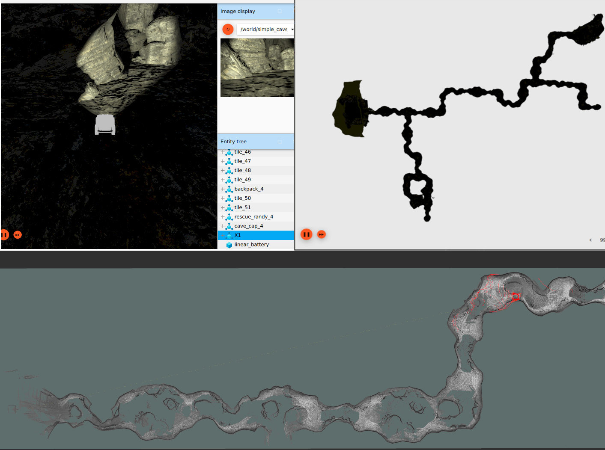

*An overview of a Robot SLAM stack*

---

SubT Hello World
====

This repository holds a set of quick-start hello world tutorials for the DARPA SubT virtual testbed. These tutorials will walk you through the complete process of developing the software stack for a simulated robot. Please refer to the following resources for additional information and assistance:

*Current Tutorials*
* [Tutorial 1: Hello World](https://github.com/osrf/subt_hello_world/blob/master/posts/01_hello_world.md)
* [Tutorial 2: Docker & SLAM](https://github.com/osrf/subt_hello_world/blob/master/posts/02_docker_and_slam.md)

*Official SubT Resources*
* [The Official SubT Virtual Testbed Website](https://www.subtchallenge.world/)
* [Full information regarding the DARPA SubT program can be found here.](https://www.subtchallenge.com/)  
* [The full SubT source code is available here](https://github.com/osrf/subt).
* [Additional SubT related Tutorials](https://github.com/osrf/subt/wiki/Tutorials)
* [The DARPA YouTube Channel](https://www.youtube.com/playlist?list=PL6wMum5UsYvYpbhQALOcbhzXYTt3qnzqA) is a great resource for coverage of the SubT Systems Events. 

*ROS Related Resources*
* ROS has its own Q&A website [answers.ros.org](https://answers.ros.org/questions/). This is a great resource for getting your ROS related questions answered.
* [ROS Discourse](https://discourse.ros.org/) is our community discussion and announcement forum.
* [ROS 1 Documentation can be found on our Wiki.](http://wiki.ros.org/) 
* A full list of ROS binary packages can be found at [index.ros.org](https://index.ros.org/)

*Gazebo Simulation Resources*
* [Main Gazebo Website](http://gazebosim.org/)
* [Gazebo Q&A Website](https://answers.gazebosim.org/questions/)
* [Gazebo Discourse Website](https://community.gazebosim.org/)
