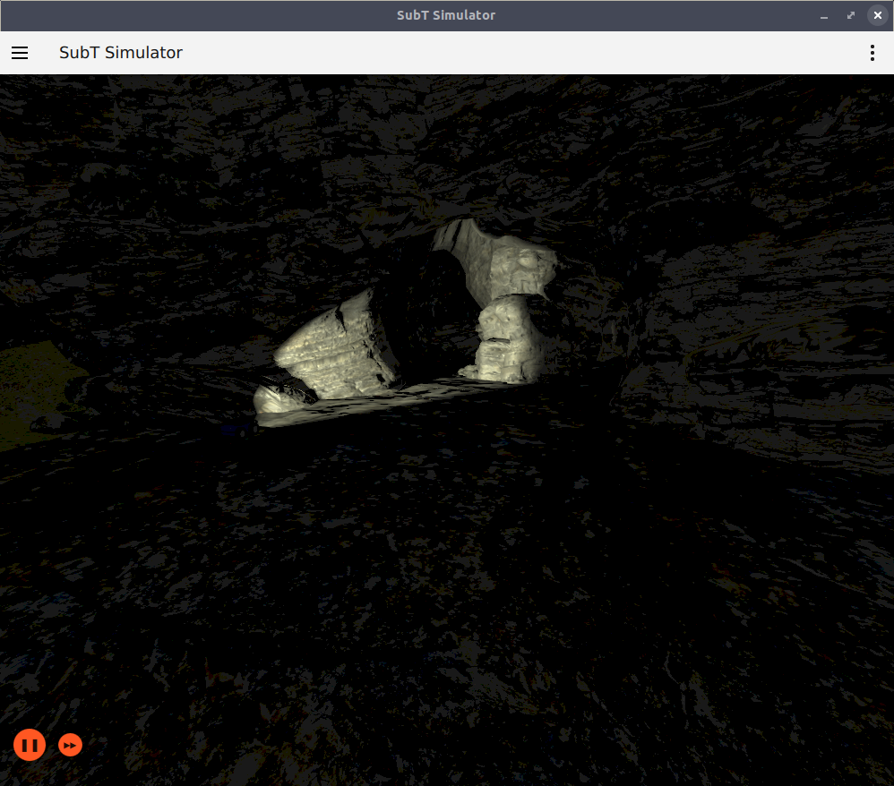
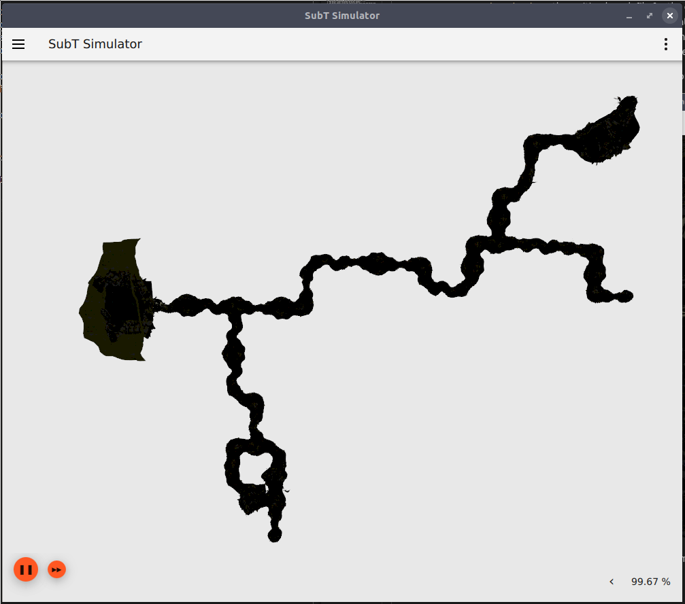
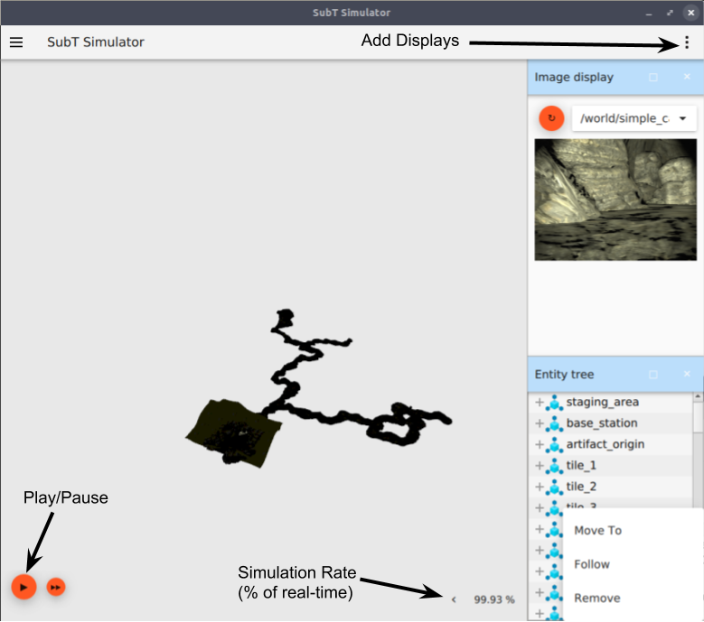
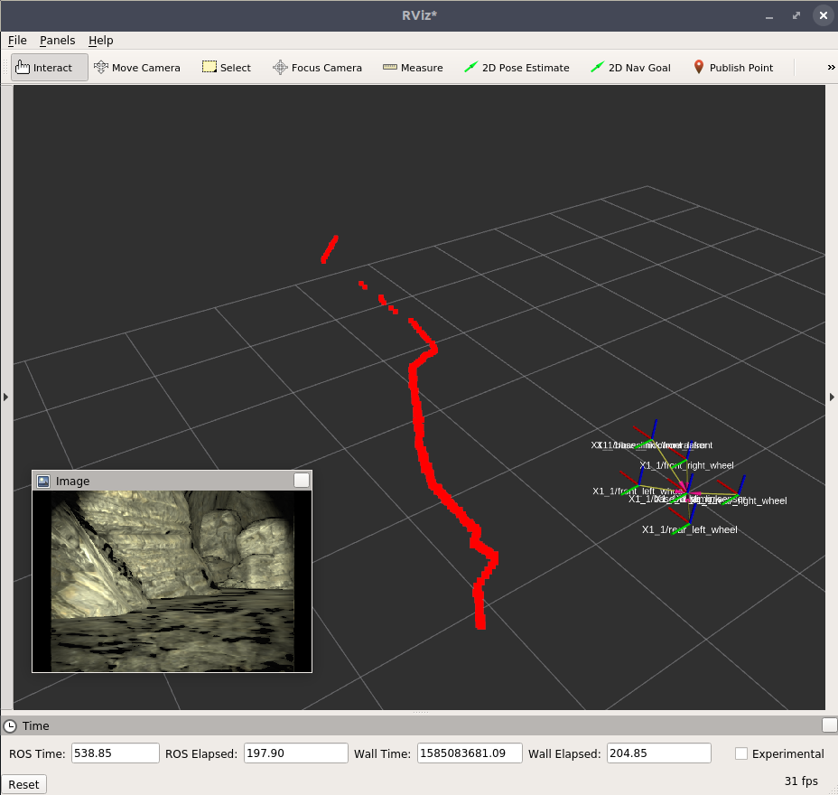

 Getting Started with the SubT Virtual Testbed

## Introduction

Now that the simple cave environments have been released, it is an excellent time to get started experimenting with the [DARPA Subterranean (SubT) Challenge Virtual Testbed](https://subtchallenge.world) and writing your own solution.

The SubT Virtual Testbed is based on the [Ignition Gazebo](https://ignitionrobotics.org) simulator.
It allows competitors to simulate teams of robots in different subterranean environments.
Powered by competitors' autonomy algorithms, the robot team must explore as much of the underground environment as possible and report the locations of various artifacts.

While prototyping and experimentation happen on a local developer's computer, all solutions must be submitted to CloudSim (the cloud-based simulation environment discussed [here](https://github.com/osrf/subt/wiki/cloudsim_architecture)) to join the leaderboards and compete for the prize money.


Through a series of posts, we will go through the process of building and submitting a competition solution.

## Hello (Subterranean) World!

To begin with, let's get the development environment up and running locally.
The best way to get the environment along with all of the dependencies is by using `docker`.
The latest SubT Virtual Testbed release is always hosted on [DockerHub](https://hub.docker.com/r/osrf/subt-virtual-testbed).

### Installing Docker


Before installing docker, take a look at the [system requirements](https://github.com/osrf/subt/wiki/system_requirements).
The simulator relies on having a hardware-accelerated graphics card in order to do rendering for the user interface as well as simulated sensors.

If you don't already have `docker` installed on your system, then it's best to follow the installation instructions in the [Installation Wiki](https://github.com/osrf/subt/wiki/tutorials/SystemSetupDockerInstall).

It is important to note that you need `docker` and `nvidia-docker` in order to get the simulation environment to work.


As a quick sanity check, you can verify if docker is installed correctly by running:

```
$ docker run hello-world
```

If all goes well, you should see something like the following:
```
Hello from Docker!
This message shows that your installation appears to be working correctly.

To generate this message, Docker took the following steps:
 1. The Docker client contacted the Docker daemon.
 2. The Docker daemon pulled the "hello-world" image from the Docker Hub.
    (amd64)
 3. The Docker daemon created a new container from that image which runs the
    executable that produces the output you are currently reading.
 4. The Docker daemon streamed that output to the Docker client, which sent it
    to your terminal.

To try something more ambitious, you can run an Ubuntu container with:
 $ docker run -it ubuntu bash

Share images, automate workflows, and more with a free Docker ID:
 https://hub.docker.com/

For more examples and ideas, visit:
 https://docs.docker.com/get-started/
```

If this is your first time installing `docker`, you may need to add your user to the `docker` group to run the above command without `sudo` (in this case, `sudo` should not be required).
To add your user to the group: `sudo usermod -a -G docker $USER` (you will need to restart your machine after entering this command in order for changes to take effect)

You can then verify that nvidia-docker is properly configured with the following:
```
docker run --runtime=nvidia --rm nvidia/cuda nvidia-smi
```

Once again, if it is installed correctly, you should see information about your video card, for example:
```
+-----------------------------------------------------------------------------+
| NVIDIA-SMI 390.116                Driver Version: 390.116                   |
|-------------------------------+----------------------+----------------------+
| GPU  Name        Persistence-M| Bus-Id        Disp.A | Volatile Uncorr. ECC |
| Fan  Temp  Perf  Pwr:Usage/Cap|         Memory-Usage | GPU-Util  Compute M. |
|===============================+======================+======================|
|   0  GeForce GTX 106...  Off  | 00000000:01:00.0  On |                  N/A |
|  0%   48C    P0    27W / 200W |    957MiB /  6075MiB |      3%      Default |
+-------------------------------+----------------------+----------------------+

+-----------------------------------------------------------------------------+
| Processes:                                                       GPU Memory |
|  GPU       PID   Type   Process name                             Usage      |
|=============================================================================|
+-----------------------------------------------------------------------------+
```

Note, the CUDA version of the container needs to match what is installed on your host.
If you know that you have CUDA 9.0 installed, or if you get errors when trying to run the `nvidia/cuda:latest` image, try running the following instead:
```
docker run --runtime=nvidia --rm nvidia/cuda:9.0-base nvidia-smi
```

### Obtaining the Simulation Container

Once docker is successfully installed, it's time to get a copy of the simulation environment and start it up.

Docker itself has many command-line options for configuration, so the development team has put together a script to batch the common arguments for the SubT Virtual Testbed. You'll want to clone the SubT Virtual Testbed repository for this script and other tools.

Clone the repository:

```
git clone https://github.com/osrf/subt.git
```

Then, to execute the simulation environment, run:

```
./subt/docker/run.bash osrf/subt-virtual-testbed:latest \
   cave_circuit.ign \
   circuit:=cave \
   worldName:=simple_cave_01 \
   robotName1:=X1 \
   robotConfig1:=X1_SENSOR_CONFIG_1
```

To expand on the arguments of this script:

* `osrf/subt_virtual-testbed:latest` - the name/version of the container from [DockerHub](https://hub.docker.com/r/osrf/subt-virtual-testbed)
* `cave_circuit.ign` - the Ignition-launch file for the cave simulation
* `circuit` - the name of the competition event (tunnel, urban, cave, or finals)
* `worldName` - the name of the world to launch (currently, there are three simple cave variants)
* `robotName` - the name of the first robot performer in the team
* `robotConfig` - the configuration of the first robot performer in the team (robots can be found on the [SubT Tech Repo](https://subtchallenge.world/openrobotics/fuel/collections/SubT%20Tech%20Repo) with details on the [Robot Wiki](https://github.com/osrf/subt/wiki/robots))

Once the simulation environment is loaded, you should be presented with a window like this:



You can use the mouse controls to explore the cave environment from the simulator perspective.
We will examine the robot sensor data in a bit.
For instance, this is a top-down view of the first simple cave environment:



### The Simulation GUI

There are a few features of the simuluation GUI worth noting:



In the main simulation window, there are play/pause buttons, as well as a simulation rate indicator.
The rate indicator measures how the simulation performance is keeping up with the progression of real time.
Generally, the real time factor (RTF) should not exceed 100%, as the simulator is trying to stay at a 1:1 rate with real time.
The real time factor may drop as many robots are added to the environment, or if robots with complex sensors are added to the environment.

The triple dots at the top right of the GUI window allow the user to add more displays to the GUI environment.
There are several displays available to aid in navigating the simulation space as well as visualizing various simulator state.

Some helpful displays:

* *View Angle* - Change the camera to common views (e.g., top, left, front)
* *Entity Tree* - See a list of entities (worlds and models) in the simulation environment
* *Transform control* - Manipulate entities in the simulation environment
  * Additionally, right clicking on an entity reveals options to cause the user camera to "Move To" or "Follow" a selected entity.
* *Video Recorder* - Record videos of the simulation window
* *Publisher* - Manually publish messages on selected topics
* *Topic Echo* - Display messages from selected topics
* *Image Display* - Display images from camera sensors

In the screenshot above, the *Image display* and *Entity Tree* displays are enabled.

### Exploring the Simulator API

Before anything else, we can take a moment to see what ROS topics and services are exposed as part of the SubT Simulator API.
To accomplish this, for now, we will run a second process in the same docker container.
Note that for competition submissions to CloudSim, a solution must exist in its own container.
This method will be described later, but for now, we will run only one docker container to explore without added complexity.

Use the following to get a shell in the running container:
```
# The docker ps command shows running containers - select & copy the CONTAINER ID for the subt-virtual-testbed image

# Create a new Bash session in the container using the CONTAINER_ID from above
docker exec -it [CONTAINER_ID] /bin/bash
```

This can additionally be aliased to something a bit shorter like
```
docker exec -it `docker ps --filter ancestor=osrf/subt-virtual-testbed --format {{.ID}}` /bin/bash
```


We now have a shell environment with ROS available:
```
developer@dalinar:~/subt_ws$ rostopic list
/X1/battery_state
/X1/cmd_vel
/X1/front/camera_info
/X1/front/image_raw
/X1/front/image_raw/compressed
/X1/front/image_raw/compressed/parameter_descriptions
/X1/front/image_raw/compressed/parameter_updates
/X1/front/image_raw/compressedDepth
/X1/front/image_raw/compressedDepth/parameter_descriptions
/X1/front/image_raw/compressedDepth/parameter_updates
/X1/front/image_raw/theora
/X1/front/image_raw/theora/parameter_descriptions
/X1/front/image_raw/theora/parameter_updates
/X1/front_scan
/X1/gas_detected
/X1/imu/data
/X1/odom
/X1/pose
/clock
/rosout
/rosout_agg
/subt/score
/tf
/tf_static
```

(If you'd ever like to exit this docker shell, simply enter `exit` to return to a regular shell)

We can introspect into any of the topics that we find interesting, such as the state of the battery on our first robot.
```
developer@dalinar:~/subt_ws$ rostopic echo /X1/battery_state
header:
  seq: 13191
  stamp:
    secs: 273
    nsecs: 788000000
  frame_id: ''
voltage: 12.6940002441
current: 0.0
charge: 78.4000015259
capacity: 78.4000015259
design_capacity: nan
percentage: 1.0
power_supply_status: 4
power_supply_health: 0
power_supply_technology: 0
present: True
cell_voltage: []
location: ''
serial_number: ''
---
```

Additionally, we can use the RViz GUI to visualize sensor data (this will be covered in greater depth later):
```
developer@dalinar:~/subt_ws$ rviz
```



### Teleoperation

As a final introduction to the cave environments, we can teleoperate our robot around the cave.

#### Joystick Teleoperation

Any of the ROS teleoperation tooling should work for this task, but if you have a [Logitech F310](https://www.logitechg.com/en-us/products/gamepads/f310-gamepad.html) or an XBox 360 controller, there is a preconfigured `roslaunch` file for the task.

In a new terminal connected to the docker container (repeat the steps above)
```
# Get a shell in the docker container
docker exec -it `docker ps --filter ancestor=osrf/subt-virtual-testbed --format {{.ID}}` /bin/bash


# Test using a joystick
roslaunch subt_example teleop.launch
```

The teleoperating node is made to work with the team of robots.
With the simulator environment launched with the `X1` configuration, as above, we want to control the `X1` robot.
To do this, press the *B* button on the controller to switch to `X1`, press and hold the *left shoulder* button to engage the safety switch, and drive with the *left joystick*


More detailed information on how to use the controller to control robots in the SubT Simulator can be found [here](https://github.com/osrf/subt/wiki/tutorials/ExampleSetup).

#### Keyboard Teleoperation

If you don't have a joystick available, it is still possible to teleoperate using the keyboard.
The `teleop_twist_keyboard` package is not installed in the simulator container by default, but it is easily added (remember to enter this command in the shell corresponding to the docker container):

```
sudo apt-get update && sudo apt-get install ros-melodic-teleop-twist-keyboard
```

Once installed, launch the keyboard teleop with appropriate topic remapping:

```
rosrun teleop_twist_keyboard teleop_twist_keyboard.py /cmd_vel:=/X1/cmd_vel
```

Note any packages installed in a docker container will need to be commited to enable them to persist after exiting.

## Conclusion and Next Steps

In this post, we have seen how to teleoperate a robot platform using the SubT Virtual Testbed and visualize some of the robot's sensor data.

If you like to participate or explore more, here are some helpful resources:
* [SubT Virtual Portal](https://subtchallenge.world/home): hosts competition information, registration, SubT Tech Repo, CloudSim submissions, and leaderboards
* [SubT Virtual Testbed Repository](https://github.com/osrf/subt/wiki/Home): hosts source code for the testbed
* [SubT API Wiki](https://github.com/osrf/subt/wiki/api): enumerates ROS topics and services in the SubT Virtual Testbed
* [SubT Robot Wiki](https://github.com/osrf/subt/wiki/robots): enumerates the list of pre-made robot models in the SubT Tech Repo for the Virtual Competition

---

**Distribution Statement "A" (Approved for Public Release, Distribution Unlimited)**
