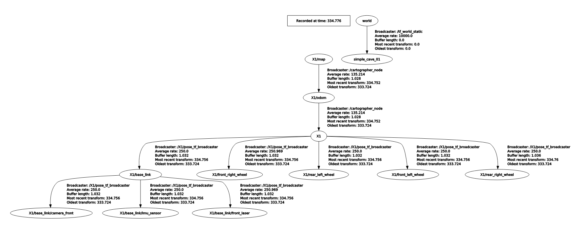
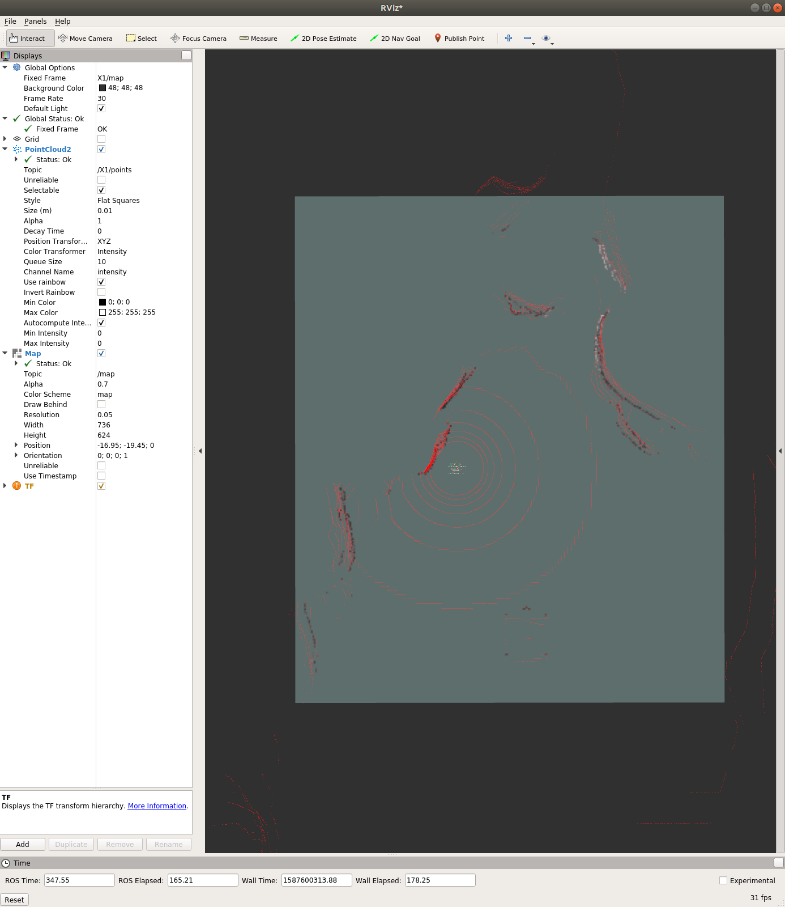
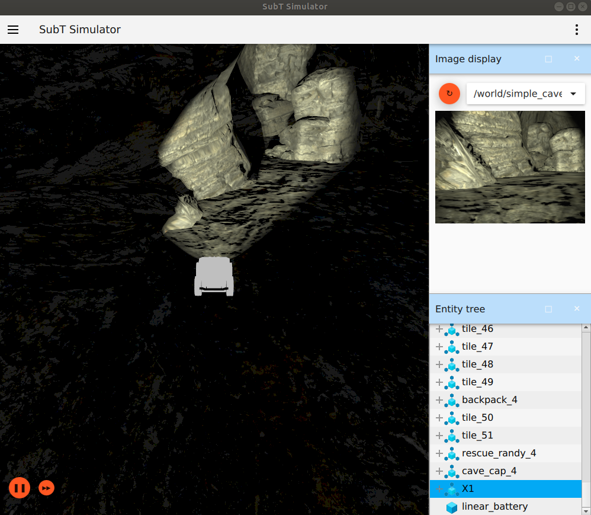
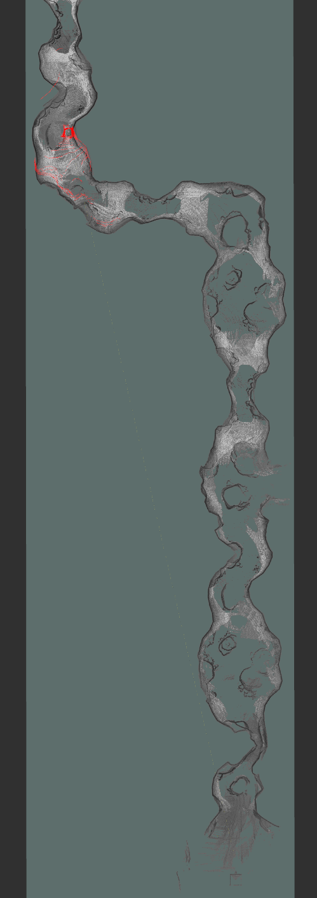

# Setting up a Development Environment for the SubT Challenge

## Introduction

In this post, we will outline two different ways of using Docker to work with the SubT Virtual Testbed: development and deployment/submission.
In the case of the development environment, it is more convenient to "mount" the local files into the container filesystem to iterate rapidly.
Using a mounted file system will allow you to edit your source code files with your favorite editor or IDE.
In the case of the deployment/submission environment (for submitting a solution to Cloudsim), the solution needs to be a fully self-contained environment in a Docker image.

In order to ensure that our development environment is set up properly, we will also configure and run a Simultaneous Localization and Mapping (SLAM) library on a ground robot in one of the SubT Challenge cave environments.

## Docker

There are several advantages to using a Docker container for development and deployment.
The primary reason is that Docker containers allow for all of the required dependencies to be accurately captured in a way that can be easily reproduced.
This allows multiple developers to keep their dependencies in sync, and ensures that the solution container that is ultimately deployed contains all required dependencies.

In case you would like to learn more about Docker, there are several tutorials available online:
  * Docker's official [quick start guide](https://docs.docker.com/get-started/)
  * A more detailed [tutorial](https://docker-curriculum.com/)
  * Docker [documentation](https://docs.docker.com/)

### Building a Docker Container

In this repository, you will find several resources to assist in building and executing Docker containers.
To begin, we will learn how to build a container.

First, clone the git repository to a working directory:

```
cd ~
git clone https://github.com/osrf/subt_hello_world
cd ~/subt_hello_world/docker
```

Once in the `docker` directory, you should see the following files relevant to building Docker images:
```
build_common_image.bash   # Used to build a Docker image that has components for both the development and entry images
build_dev_image.bash      # Used to build a Docker image for the development environment
build_entry_image.bash    # Used to build a Docker image for competition submission ("deployment")
```

Inside the `hello_world_common`, `hello_world_entry`, and `hello_world_dev` directories, you can also find the `Dockerfile` that gives the enumerated steps for creating the Docker images.

For an introduction, let's begin with building one of the images. Then, we can take a closer look at what each configuration is doing.

To build the `development` variant:
```
$ cd ~/subt_hello_world/docker
$ ./build_common_image.bash
$ ./build_dev_image.bash
```

This should go through the sequence of steps in both `hello_world_common/Dockerfile` and `hello_world_dev/Dockerfile`, and then successfully produce the image.
It's important to run the `build_common_image` script first, because this will create an image with the dependencies that the development (and entry) image needs.
At the end of execution, you should see output similar to:

```
Successfully built 4bd73f0003ef
Successfully tagged subt_dev:latest
```

You can also confirm that the build was successful by listing the available images on your system:
```
$ docker images
REPOSITORY                                    TAG                      IMAGE ID            CREATED             SIZE
...
subt_dev                                      latest                   4bd73f0003ef        2 hours ago         7.81GB
subt_hello_world_common                       latest                   31cda4f81e62        14 hours ago        7.81GB
...
```

### Docker for Development

The primary distinction between how the container is built for development versus deployment is how the source code and binary artifacts are handled.
In the case of the development container, the source code is not included in the built container itself. Instead, the source code is [mounted](https://docs.docker.com/storage/bind-mounts/) into the container at runtime.
This mounting mechanism means that you can continue modifying the source code on the host machine while the container is still running, and the changes will be reflected in the running container.

You can start the development container by calling the `run_dev_container` script in the repository's `docker` directory.
This script requires a path to where your SubT solution source code resides on your local machine.
As an example, let's use the `subt_solution_launch` template code in this repository:
```
$ ./run_dev_container.bash ~/subt_hello_world/subt_solution_launch
```

You should now be in a bash shell inside the docker container.
Let's take a look at where the source code has been mounted inside the container:
```
$ ls ~/workspaces/solution_ws/src/subt_solution_launch/
CMakeLists.txt  config  launch  package.xml  scripts
```

Now that we have mounted our source code into a workspace (`solution_ws`) inside the docker container, it is time to build this workspace.
This can be done by running the `setup_solution_ws` script in the home directory of the development container (this script was placed in the home directory via `hello_world_dev/Dockerfile`).
Running this script will:
1. Source the dependencies that were built in the `subt_common` Docker image
2. Call [rosdep](https://docs.ros.org/independent/api/rosdep/html/) to bring in any more dependencies from the mounted source code
3. Build the solution workspace with [colcon](https://colcon.readthedocs.io/en/released/index.html)

```
$ source ~/setup_solution_ws.bash
```

If source code and/or dependencies change and the solution workspace needs to be re-built, you can do this by running the `setup_solution_ws` script again.

The development container can be stopped by entering `exit` at the command line prompt.

Note: The development container is _transient_, so most changes made in the container won't persist after the container is stopped.
The only changes that will persist are those made in the `~/workspaces/solution_ws/src/subt_solution_launch/` directory, since the files in this directory were mounted as a volume.
Any packages installed won't persist unless they are added to the correct locations described below in [Adding Third-Party Dependencies](#adding-third-party-dependencies).

### Docker for Deployment

In the deployment environment, the source code is copied into the container at build time and built with the rest of the container.

You can experiment with this by running:

```
$ cd ~/subt_hello_world/docker
$ ./build_entry_image.bash
```

This will build an example image for competition submission. Once this script is complete, you should see output similar to the following:

```
Successfully built 9c5d456bb65f
Successfully tagged subt_entry:latest
```

You may find that the deployment/entry image takes longer to build than the development image because it will additionally install any dependencies from the source code and build the source code as well.
At the end of this process, the container is ready to run in the Cloudsim environment.
The solution will be launched when the container is started.

You can verify this by running the simulation environment and the solution container in separate terminals.

```
# Run a SubT simulator in the first terminal
$ cd ~/subt_hello_world/docker/simulation_runner
$ ./run.bash osrf/subt-virtual-testbed:latest \
   cave_circuit.ign \
   worldName:=simple_cave_01 \
   robotName1:=X1 \
   robotConfig1:=X1_SENSOR_CONFIG_3

# Run the submission container in the second terminal
$ cd ~/subt_hello_world/docker
$ ./run_entry_container.bash X1
```

This will start the two containers in parallel.
Notice that the `run_entry_container` script requires one parameter: the name of the submission container.
It is recommended to name the container with the name of the robot in the simulation environment (in this case, `X1`).

In the current iteration, the solution container doesn't do anything with the robot.
We will be experimenting with mapping later in this post.

If you'd like to stop the entry container, you can run the `docker kill` command in a separate terminal:
```
$ docker kill X1
```

### Adding Third-Party Dependencies

As you develop code that is part of your SubT solution, it is likely that your source code will introduce additional dependencies such as ROS packages.
There are two ways of adding additional dependencies into the solution workspace: binary or source.

#### Adding Binary Dependencies

It may be that a dependency that you are interested in is already available via a binary package.
There are several ways to check if a binary package exists:
1. For ROS packages, you can check if a binary package is available by searching the [ROS Melodic distro page](https://github.com/ros/rosdistro/blob/master/melodic/distribution.yaml).
2. For system-specific packages (like [OpenCV](https://opencv.org/)), you can take a look at the [Rosdep keys list](https://github.com/ros/rosdistro/tree/master/rosdep). 
3. If you prefer to use the commandline, you can search for binary packages with `apt search`.

If you find that a binary package already exists, then adding the rule to a `package.xml` in your workspace should be sufficient.

For instance, if we want our solution to additionally depend on the [octomap](https://octomap.github.io/) packages in ROS, we can find it in the available packages:
```
$ apt search octomap
...
ros-melodic-octomap/bionic,now 1.9.0-1bionic.20200303.054243 amd64 [installed,automatic]
  The OctoMap library implements a 3D occupancy grid mapping approach, providing data structures and mapping algorithms in C++.
ros-melodic-octomap-ros/bionic,now 0.4.0-0bionic.20200320.154809 amd64 [installed,automatic]
  octomap_ros provides conversion functions between ROS and OctoMap's native types.
...
```

In this case, we can add the corresponding keys to our `subt_solution_launch/package.xml`

```
<depend>octomap</depend>
<depend>octomap_ros</depend>
```

Now, in the *development* container, re-building the solution workspace will install the new dependencies:
```
$ ./run_dev_container.bash ~/subt_hello_world/subt_solution_launch
$ source ~/setup_solution_ws.bash
```

During this process, you should see that `ros-melodic-octomap` and `ros-melodic-octomap-ros` are installed.

These dependencies don't have to go explicitly in the `subt_solution_launch` package -- they should go in whichever package depends on them.
Here, we are using the launch package as an example location.

#### Adding Source Dependencies

In some cases, the packages that you are interested in are not available in the binary repositories, or the correct version is not available for your solution application.
In this case, it becomes necessary to build these dependencies from source.
The mechanism that we use to accomplish this in the solution image is a called a [workspace overlay](https://wiki.ros.org/catkin/Tutorials/workspace_overlaying).
This allows one workspace (the solution workspace) to overlay a second workspace (the dependency workspace).

One important note is that during the build process, Docker will attempt to cache layers whenever possible.
Any time the content of a layer is unchanged, Docker will use the cached version and not rerun the build step.
Because of this caching mechanism, source dependencies do not need to be rebuilt as long as they have not changed.

To enumerate what happens in each phase of the process for each configuration:
 * The _dependency_ workspace is located at `~/workspaces/dependencies_ws` in the container.
   * In the development container:
     * Dependencies are installed during container build
     * Workspace is built during container build
   * In the deployment container:
     * Dependencies are installed during container build
     * Workspace is built during container build
 * The _solution_ workspace is located at `~/workspaces/solution_ws` in the container.
   * In the development container:
     * Dependencies are installed during container runtime
     * Workspace is built manually by the user
   * In the deployment container:
     * Dependencies are installed during container build
     * Workspace is built during container build

In general, the dependency workspace is a good place to put any source dependencies so that they are only built once (in the _common_ Docker image).
To add a source dependency to the underlay, modify the `hello_world_deps.rosinstall` file (this file can be found in the root of the `subt_hello_world` repository).
This follows the [rosinstall file format](https://docs.ros.org/independent/api/rosinstall/html/rosinstall_file_format.html), which specifies a list of version control locations to clone into the workspace.

There are a few dependencies already specified, but we can add another: for example, [darknet_ros](https://github.com/leggedrobotics/darknet_ros) (we will be using `darknet_ros` for perception in a future blog post).
For the `darknet_ros` package, there is no pre-built package from apt, so building from source is our only option.
To do this, we'd need to modify the `hello_world_deps.rosinstall` package by adding these lines:
```
  darknet_ros:
    type: git
    url: https://github.com/leggedrobotics/darknet_ros.git
    version: master
```

In order to install this dependency so that it can be used in our Docker containers, we need to rebuild the common image, and then rebuild the development and deployment images since they depend on the common image:
```
$ ./build_common_image.bash
$ ./build_dev_image.bash
$ ./build_entry_image.bash
```

Now that we have set up our development environment through Docker, we will show how to use [cartographer](https://github.com/cartographer-project/), an open-source 3D SLAM library.

## SLAM - An Overview

A key component of the virtual challenge is having robots accurately report the locations of the artifacts in the environment(s).
In order to report these artifact locations with minimal error, the robot must first have an accurate estimate of its own position.
This estimate can be formed from a technique called _Simultaneous Localization and Mapping_ ([SLAM](https://en.wikipedia.org/wiki/Simultaneous_localization_and_mapping)).

SLAM is the process of concurrently creating an estimate of the environment around the robot (mapping) while also estimating the [pose](https://en.wikipedia.org/wiki/Pose_(computer_vision)) of the robot in the environment (localization).
Typically this is done by fusing multiple sensor sources together, such as lidar, wheel odometry, and inertial measurement units (IMUs).

The video below shows a demo of Graph SLAM, which is one of the more popular SLAM algorithms:

[](http://www.youtube.com/watch?v=hRyL5KwFLAE "Graph SLAM Demo")

As you can see in the video, the map accuracy improves when the robot revisits a place it has seen before.
This is a concept called _loop closure_.
As a robot continues to explore unknown space, the uncertainty of the robot's pose and map increase due to sensor noise.
This can cause "drift" in the robot's pose estimate, which manifests as the estimated pose moving further away from the true pose over time.
Once the robot revisits a familiar place, it regains confidence in its current pose and can correct any drift that was previously accumulated.
Loop closure is something we do as humans all the time: whenever we are driving in a place that isn't familiar, we often look for _landmarks_ (buildings or street signs, for example) that help remind us where we are.

### Performing SLAM with a Ground Vehicle

Now that we have gone over how to set up and use Docker containers for development and deployment, let's see how to perform SLAM in the development container.

Because of the nature of subterranean environments, it is necessary to estimate our pose in 3-dimensions to capture any changes in vertical position as well as horizontal. We will be using an open-source 3D SLAM library called [cartographer](https://github.com/cartographer-project/).

### Adding the source dependencies

Doing a quick search on [rosdistro](https://github.com/ros/rosdistro/blob/84a09639ff59b77f296536425b3e2d742695a2a3/melodic/distribution.yaml#L979-L1004) shows that `cartographer` is available as a binary package, so we can go ahead and add it as a dependency to the `package.xml` in the `subt_solution_launch` package:

```
<depend>cartographer_ros</depend>
```

After rebuilding the solution workspace in the development container, cartographer will be available to use.

### Configuring a Robot Platform

In order to have sufficient data to do 3-dimensional SLAM, the `cartographer` node needs a source of 3-dimensional point cloud data.
Looking at the list of [available robots](https://github.com/osrf/subt/wiki/Robots), we can see that several feature 3D lidars of various range.
For the rest of this post, we will use the X1 Sensor Configuration #3, which has a reasonable trade off between the 3D lidar range and cost.

Based on the [API](https://github.com/osrf/subt/wiki/api) and inspecting with `rostopic list` we can see the topics of interest for performing SLAM:
```
/X1/points      # sensor_msgs/PointCloud2
/X1/imu/data    # sensor_msgs/Imu
/X1/odom        # nav_msgs/Odometry
```

In our `subt_solution_launch/launch/cartographer.launch` file, we can wire these up to the correct inputs:
```
<remap from="points2" to="/X1/points" />
<remap from="imu" to="/X1/imu/data"/>
<remap from="odom" to="/X1/odom"/>
```

Finally, we have to update the `lua` configuration for the robot (this file is located in `subt_solution_launch/config/cartographer/`):
```
map_frame = "X1/map",
tracking_frame = "X1",
published_frame = "X1",
odom_frame = "X1/odom",
```

*NOTE:* The simulator uses a slightly different naming scheme for coordinate frames than what is typically used in ROS.
In this case, the root frame of the robot is actually `X1` and NOT `X1/base_link` (take a look at the TF Tree below).
This should be accounted for when creating configurations for SLAM.



### Running SLAM

Now that we have gone over the SLAM configuration, let's actually run cartogapher in our development container to make sure everything is working.
We will walk through the example workflow as a reminder on how to use Docker for testing and development.

1. Build the Docker images (remember, Docker will use cached data for image building whenever possible, so this should be instantaneous if you built the images already):

```
$ cd ~/subt_hello_world/docker
$ ./build_common_image.bash
$ ./build_dev_image.bash
```

2. Start a SubT simulator with a robot that has 3D lidar:

```
$ cd simulation_runner/
$ ./run.bash osrf/subt-virtual-testbed:latest \
   cave_circuit.ign \
   worldName:=simple_cave_01 \
   robotName1:=X1 \
   robotConfig1:=X1_SENSOR_CONFIG_3
```

3. In a new terminal, start the development container (remember to use the `subt_solution_launch` template source code):
```
$ cd ~/subt_hello_world/docker
$ ./run_dev_container.bash ~/subt_hello_world/subt_solution_launch/
```

4. In the development container, build the solution workspace (this will install the cartographer dependencies)
```
$ source ~/setup_solution_ws.bash
```

5. Start cartographer once the solution workspace has been built
```
$ roslaunch subt_solution_launch cartographer.launch name:=X1
```

6. In a new terminal, connect to a bash shell inside of the running container:
```
$ cd ~/subt_hello_world/docker
$ ./join.bash
```

7. In this new bash shell, start `rviz` so that we can visualize the map being generated by SLAM:
```
$ rviz
```

8. Set up rviz so you can see the map and robot. There's an example configuration shown below. Be sure to do the following:
  * Set the `Fixed Frame` to `X1/map`
  * Add a `PointCloud2` display and set the topic to `X1/points` (this is the robot's lidar)
  * Add a `Map` display and set the topic to `/map`
  * Add a `TF` display so you can see where the robot is



9. Now, let's modify the simulation window so that we can always view the robot when we drive it around. Once again, there's an example configuration shown below. There are two main things to do this time:
  * Select the menu (three vertical dots) in the top right corner -> click `Image Display` (you may need to scroll to find it). This will allow you to view the robot's front camera output.
  * Select the menu again -> click `Entity Tree` -> find `X1` -> right click `X1` -> and select `Follow`. Then, click on `X1` in the entity tree to highlight the robot.



10. Last step - start up teleop control (either through a joystick or keyboard) so that you can drive the robot around the environment and see the map update. The following shows how to start teleop control with your computer's keyboard (inside of the development container):

```
# open a new terminal and use it to connect to a bash shell in the running development container
$ cd ~/subt_hello_world/docker
$ ./join.bash

# start keyboard teleop control in the docker container
$ rosrun teleop_twist_keyboard teleop_twist_keyboard.py /cmd_vel:=/X1/cmd_vel
```

Now, drive the robot around and take a look at the map being generated in `rviz`! 
If the robot isn't moving when you give keyboard commands, make sure you click on the shell that ran the `teleop_twist_keyboard` command in step 10 (if that is not the active window, the keyboard commands are not processed as teleop input). 
Here is an example map generated after driving around for a bit in the cave environment we launched in step 2:



## Conclusion and Next Steps

In this post, we discussed how to 1) set up and use Docker for development and deployment, and 2) how to perform SLAM for the SubT Challenge with a library like cartographer.

If you are interested in learning more about how to use Docker and/or cartographer, we recommend looking at the previously mentioned [Docker tutorials](#docker) and [Cartographer ROS documentation](https://google-cartographer-ros.readthedocs.io/en/latest/).

In our next post, we will discuss how to integrate perception capabilities into our solution to detect artifacts in the SubT environments. 
We will be using `darknet_ros`, which we already set up in the [Adding Source Dependencies](#adding-source-dependencies) section. 
If you'd like to start learning more about how `darknet_ros` works, feel free to take a look at the [Darknet ROS repository](https://github.com/leggedrobotics/darknet_ros).

---

**Distribution Statement "A" (Approved for Public Release, Distribution Unlimited)**