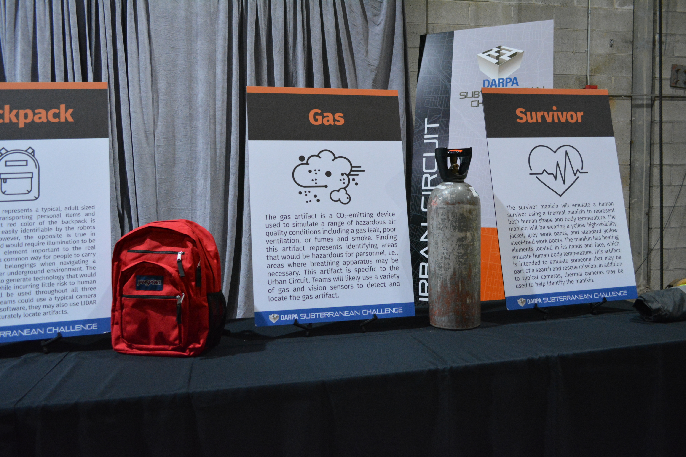
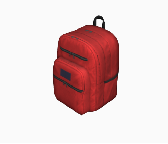
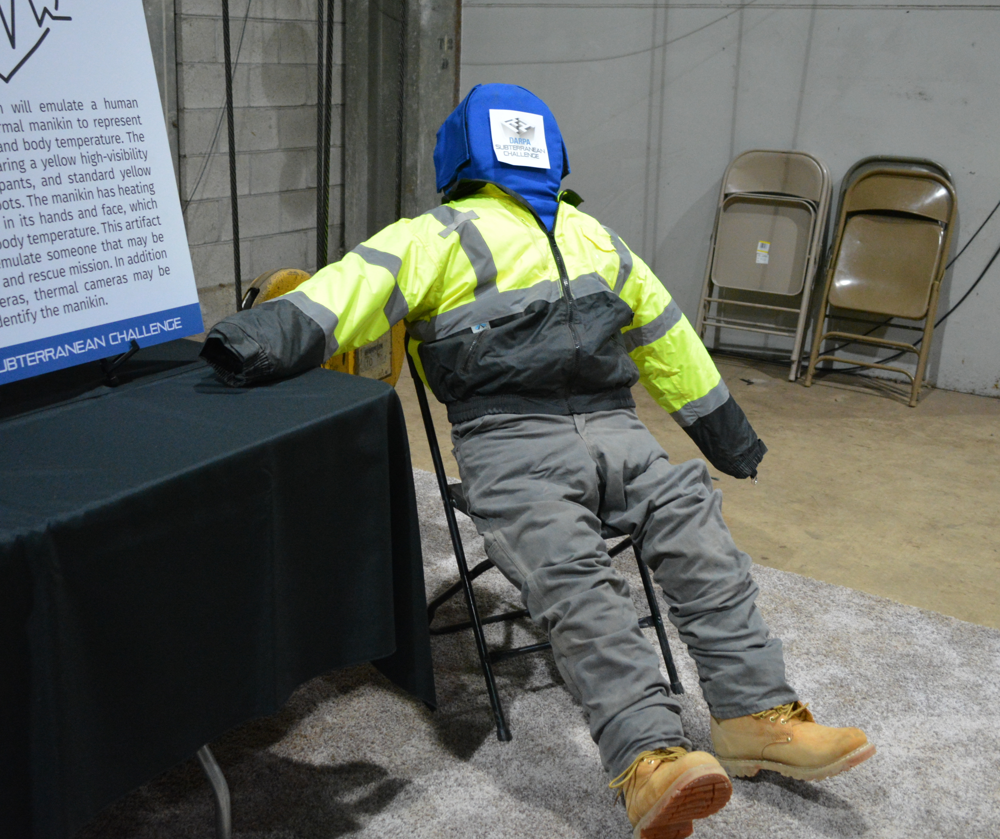
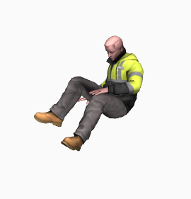
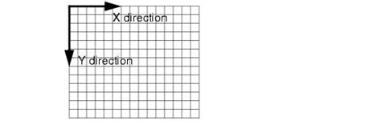
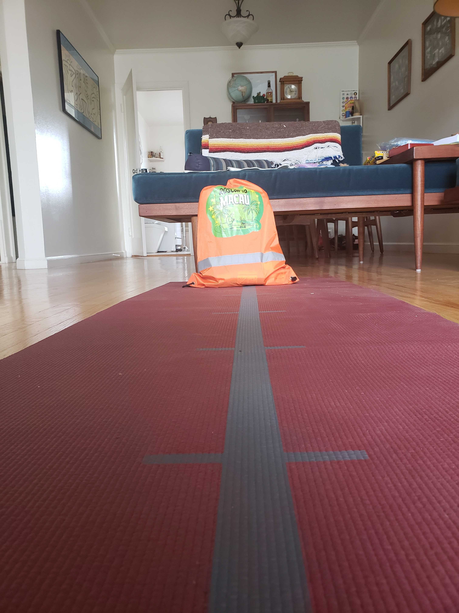

# Detecting and Reporting SubT Challenge Artifacts

## Introduction

In this post, we will discuss how to add perception capabilities into our development environment.
A major aspect of the SubT Challenge is to detect _artifacts_ in the environment and correctly report where these artifacts are located.
In order to do this, we need:

1. An accurate mapping and localization (SLAM) framework that tells us where we are.
2. A perception system that can recognize artifacts.

We have already discussed how to set up SLAM in blog post [#2](./02_docker_and_slam.md).
If you haven't set up SLAM yet, please take a moment to do so now.

## SubT Challenge Artifacts

Before we cover how to set up a perception system that can detect the artifacts, let's provide some more details on the artifacts themselves.

The SubT Challenge artifacts are specified [here](https://www.subtchallenge.com/resources/SubT_Cave_Artifacts_Specification.pdf).
One important thing to note is that there are three common artifacts for every competition event:
1. Backpack
2. Survivor
3. Cell Phone

There are also two artifacts that are unique to the Cave Circuit:
1. Helmet
2. Rope

The images below show what a few of the artifacts look like.

 

_The backpack and gas artifacts.
The gas artifact is from the Urban Circuit: it emits CO2 to simulate the presence of a gas._

 

_The survivor artifact, which is heated to mimic human body temperature._

Now that the artifacts have been introduced, let's learn how to detect and report them.
We will go over how to detect the artifacts first.

## Perception With Darknet ROS

We will be using [darknet_ros](https://github.com/leggedrobotics/darknet_ros) as our perception system.
This is a ROS package that contains a few pre-trained neural networks based on the [YOLO](https://pjreddie.com/darknet/yolo/) architecture.
We will be using one of these pre-trained neural networks to identify the artifacts discussed above.

The following video provides an introduction to neural networks for those who are unfamiliar with the concept:

[](http://www.youtube.com/watch?v=aircAruvnKk "Neural Network Tutorial")

### Setup

In order to use `darknet_ros`, we need to add it as a dependency to our workspace.
We already did this in blog post [#2](./02_docker_and_slam.md), but as a refresher, let's go over how we set up this dependency.

First, let's take a look at the `hello_world_deps.rosinstall` file.
We can see that `darknet_ros` has been added as a dependency:

```
repositories:
  ...
  darknet_ros:
    type: git
    url: https://github.com/leggedrobotics/darknet_ros.git
    version: master
  ...
```

Since the `darknet_ros` repository has been listed in the `rosinstall` file, this means that we will be building this dependency from source.
We have to build `darknet_ros` from source because it is not available to download as a binary package (running `apt search` yields no results):

```
$ apt search darknet
Sorting... Done
Full Text Search... Done
$
```

Now that we have this dependency included, let's build the common and development docker images if you haven't already (building the common image may take a while since we have to build `darknet_ros` from source):

```
$ cd ~/subt_hello_world/docker
$ ./build_common_image.bash
$ ./build_dev_image.bash
```

Let's run a quick test in a docker container to make sure that Darknet was installed properly:

```
$ ./run_dev_container.bash ~/subt_hello_world/subt_solution_launch

# run the following commands in the docker container
$ source ~/setup_solution_ws.bash
$ roslaunch darknet_ros yolo_v3.launch
```
You should see output similar to this:

```
...
Loading weights from /home/developer/workspaces/dependencies_ws/install/darknet_ros/share/darknet_ros/yolo_network_config/weights/yolov3.weights...Done!
Waiting for image.
Waiting for image.
...
```

Now that we know Darknet is working in the container, let's start a simulation window and connect this perception system to the robot's camera.
Open up another terminal and start the SubT Simulator (leave Darknet running in the docker container).
Let's use the [Husky](https://github.com/osrf/subt/wiki/Robots) robot since it has a good 3D lidar for SLAM, as well as an RGBD camera (this will be useful for reporting the artifact's location later):

```
$ cd ~/subt_hello_world/docker/simulation_runner
$ ./run.bash osrf/subt-virtual-testbed:latest \
   cave_circuit.ign \
   worldName:=simple_cave_01 \
   robotName1:=X1 \
   robotConfig1:=COSTAR_HUSKY_SENSOR_CONFIG_1
```

You'll notice that Darknet still says, "_waiting for image._"
This means that Darknet is not receiving images from the robot's camera in the SubT Simulator.
We can use the [rosnode](https://wiki.ros.org/rosnode) command line tool to help us debug why Darknet is not receiving images.

First, open a new terminal and connect to the development docker container, which has `rosnode` (and other ROS command line tools) installed:

```
$ cd ~/subt_hello_world/docker
$ ./join.bash
```

In the container, let's use `rosnode` to learn more about the `darknet_ros` node:

```
# we can use 'list' to view all of the nodes that are currently running
$ rosnode list
...
/darknet_ros
...

# we can use 'info' to get information about a specific node
$ rosnode info /darknet_ros
...
Subscriptions:
 * /camera/rgb/image_raw [unknown type]
 * /darknet_ros/check_for_objects/cancel [unknown type]
 * /darknet_ros/check_for_objects/goal [unknown type]
...
```

As we can see from `rosnode info`, the `darknet` node is looking for an image from the `/camera/rgb/image_raw` topic.
Let's see what topic the robot's camera is publishing images to.
Go back to the docker container where we were running `rosnode` and run the following (notice that we are using [rostopic](https://wiki.ros.org/rostopic?distro=melodic) now):

```
$ rostopic list
...
/X1/front/camera_info
/X1/front/image_raw
/X1/front/image_raw/compressed
/X1/front/image_raw/compressed/parameter_descriptions
/X1/front/image_raw/compressed/parameter_updates
/X1/front/image_raw/compressedDepth
/X1/front/image_raw/compressedDepth/parameter_descriptions
/X1/front/image_raw/compressedDepth/parameter_updates
/X1/front/image_raw/theora
/X1/front/image_raw/theora/parameter_descriptions
/X1/front/image_raw/theora/parameter_updates
...


$ rostopic info /X1/front/image_raw
Type: sensor_msgs/Image

Publishers:
 * /X1/ros_ign_image_camera (http://osrf:39129/)

Subscribers:
 * /bridge_logger (http://osrf:40359/)
```

It appears as if Darknet needs to subscribe to the `/X1/front/image_raw` topic instead of the `/camera/rgb/image_raw` topic.
We can change the topic that Darknet subscribes to by modifying the launch file.
Let's take a look at the current launch file (again, run the following commands in the docker container we were just using for `rostopic`):

```
$ roscd darknet_ros
$ cat launch/yolo_v3.launch
<?xml version="1.0" encoding="utf-8"?>

<launch>

  <!-- Use YOLOv3 -->
  <arg name="network_param_file"         default="$(find darknet_ros)/config/yolov3.yaml"/>
  <arg name="image" default="camera/rgb/image_raw" />


  <!-- Include main launch file -->
  <include file="$(find darknet_ros)/launch/darknet_ros.launch">
    <arg name="network_param_file"    value="$(arg network_param_file)"/>
    <arg name="image" value="$(arg image)" />
  </include>

</launch>
```

All we need to do is change the following line to match the topic our robot's camera is publishing images to (`/X1/front/image_raw`):

```
# this is what the image topic is currently set to
<arg name="image" default="camera/rgb/image_raw" />

# this is the image topic we need Darknet to use
<arg name="image" default="/X1/front/image_raw" />
```

Luckily, we have already made this change in the `subt_solution_launch` package.
Let's go back to the docker container and take a look at this new launch file:

```
$ roscd subt_solution_launch/
$ cat launch/yolo_v3-tiny.launch
<?xml version="1.0" encoding="utf-8"?>

<launch>

  <!-- Use YOLOv3 -->
  <arg name="network_param_file"         default="$(find subt_solution_launch)/config/darknet_ros/yolov3-tiny.yaml"/>
  <arg name="image" default="/X1/front/image_raw" />
  <!-- <arg name="image" default="/validator/front/image_raw" /> -->

  <!-- Include main launch file -->
  <include file="$(find darknet_ros)/launch/darknet_ros.launch">
    <arg name="network_param_file"    value="$(arg network_param_file)"/>
    <arg name="image" value="$(arg image)" />

    <arg name="yolo_weights_path"     value="$(find subt_solution_launch)/config/darknet_ros"/>
    <arg name="yolo_config_path"      value="$(find subt_solution_launch)/config/darknet_ros"/>
  </include>

</launch>
```

You may have also noticed that we are using a different kind of network as well (`yolov3-tiny` instead of `yolov3`).
This is because we can get predictions at a faster rate with higher recall using the smaller `yolov3-tiny` network in comparison to the full sized `yolov3` network.

Okay, now let's re-run Darknet with our modified launch file to see everything work!
Go back to the terminal that is running Darknet and kill that node (`ctrl-C` should do the trick).
Run our modified launch file instead:

```
$ roslaunch subt_solution_launch yolo_v3-tiny.launch
```

You should now see some output in the terminal window with frame rate and detected object information (as of now, we have not detected any artifacts in the environment, so the `objects` output will probably be empty).
If you still see a _waiting for image_ message, make sure you have a SubT Simulator running.
You should also see a `YOLO V3` GUI window, showing the output of the camera along with any objects that are detected in the frame:


Now, we can drive around the cave environment to see if the robot can detect artifacts.

### Detecting Artifacts With Darknet

Let's see if we can detect one of the common artifacts by driving around in the cave environment with perception enabled.

You should already have the simulator running, along with the Darknet node that is subscribed to the proper camera topic.
The last step is to enable teleop control so that we can drive around in the environment until we find an artifact.
We can use the keyboard for input like we did in blog post #2:

```
# open a new terminal and connect to the development docker container
$ cd ~/subt_hello_world/docker/
$ ./join.bash

# run the following command in the docker container to run teleop control via keyboard
$ rosrun teleop_twist_keyboard teleop_twist_keyboard.py /cmd_vel:=/X1/cmd_vel
```

All set!
Now, drive around and see if you can detect an artifact. The first thing I found was a backpack:


As you can see, the neural network thought that this backpack was a suitcase.
That's not too bad for something that wasn't even trained on an artifact dataset (we are using a neural network that was trained on the [Pascal VOC Dataset](https://pjreddie.com/projects/pascal-voc-dataset-mirror/)).
If you'd like to use this pre-trained network to detect artifacts like backpacks, you can always create a mapping between the network's pre-trained labels and artifact labels in the solution code you write (so for example, one mapping would be `suitcase -> backpack`).

### So Why Are We Using Pre-Trained Neural Networks?

While the object detection algorithm that ships with Darknet gets us a workable solution, it probably doesn't perform as well as it could, and most likely it will miss quite a few artifacts.
The reason for this is related to the [generalization problem in deep learning](https://youtu.be/pFWiauHOFpY).
Simply put, the underlying algorithm was trained on real world images of many objects, and we're using it in a simulated environment for specific artifacts.
While Darknet is trained to recognize many objects from suitcases to cars to toothbrushes, we are only interested in detecting SubT Challenge artifact models.
If we want to improve our performance we could build a custom data set in our simulation and then fine tune the underlying model.
This fine tuning approach should allow the model to adapt to images taken in the simulation environment and greatly improve our performance.
In the real world, collecting data is a painful and expensive process where a system captures images and then are carefully labeled by human annotators.
In simulation we can either replicate this annotation process or write a custom plugin to perform the annotation automatically.
In either case the complexity of this task is outside the scope of this tutorial.

## Reporting the Detected Artifacts for Scoring

Now that we can detect artifacts, the next step is to report the detected artifact's location for scoring.
The way a point is scored in the SubT Challenge is by _"accurately"_ reporting an artifact's location - so what does _"accurately"_ mean?

The [SubT Challenge Rules](https://www.subtchallenge.com/resources/SubT_Challenge_Urban_Rules.pdf) (see section 11.1) state that in order to receive a point for finding an artifact, the artifact location you report must be within 5 meters of the artifact's ground truth location.
An artifact's ground truth location is defined as the location of the artifact's localization point with respect to the `artifact origin`, which is a spot near the environment's entrance (localization points for each artifact are defined in the [SubT Challenge Artifacts Specification Guide](https://www.subtchallenge.com/resources/SubT_Cave_Artifacts_Specification.pdf)).
You can think of the `artifact origin` as a universal coordinate frame for the artifacts.

So, in order for us to receive points for artifacts that we find, we must do the following:

1. Generate a map with SLAM
2. Find where the `artifact origin` is with respect to the map we are using
3. Detect an artifact
4. Determine where this detected artifact is
5. Report the artifact's type (and location) to the `base station` for scoring

We have already taken care of steps 1 and 3 by setting up Cartographer for SLAM and Darknet for perception.
Let's go over the remaining items on our TODO list (we will be using transforms frequently to accomplish steps 2, 4, and 5. If you are unfamiliar with the concepts of transforms, it's recommended to go through the [tf2 tutorials](https://wiki.ros.org/tf2/Tutorials) first).

### Locate the Artifact Origin

Let's take a look at the transform tree we had after setting up SLAM in blog post [#2](./02_docker_and_slam.md):


As we can see, there's always a way for us to know where the robot is located in the map because there is a transform available from `X1/map -> X1`.
Now, we need to generate a transform between `X1/map -> artifact origin`.
This will allow us to get the location of detected artifacts with respect to the `artifact origin` regardless of where the robot (`X1`) is in the map.

The [SubT Virtual Testbed API](https://github.com/osrf/subt/wiki/api#artifacts) mentions that in order to find the robot pose relative to the artifact origin, you must call the `/subt/pose_from_artifact_origin` service when in the staging area.
We've gone ahead and implemented how to use this service in the `find_artifact_origin.cpp` file, which is in the `subt_solution_launch/src` directory.
Let's take a look at some of the code:

```
// set up service call
ros::ServiceClient client = nh.serviceClient<subt_msgs::PoseFromArtifact>(service_name);
subt_msgs::PoseFromArtifact srv;
srv.request.robot_name.data = robot_name;

// ensure that transform between map->base_link is available before calling service
if (!tf_buffer.canTransform(map_frame, base_link_frame, ros::Time(0), ros::Duration(5.0)))
{
  ROS_FATAL("could not find transform between map and base_link, exiting now");
  ros::shutdown();
}
```
First, we make make sure that the map frame from Cartographer is being published.
If this frame is not available after 5 seconds, the node shuts down because we don't have all of the frames that we need in order to calculate the `X1/map -> artifact origin` transform.

```
// call service and save transforms
if (client.call(srv))
{
  // need to convert the transform from artifact_origin->base_link to base_link->artifact_origin
  // (this will allow us to get the map->artifact_origin transform)
  InvertTransform(srv);
```

We then call the service. This will give us the `artifact origin -> X1` transform (`X1` is analogous to `base_link` in this case), but we actually want the `X1 -> artifact origin` transform so that we can have the full transform tree of `X1/Map -> X1/Odom -> X1 -> artifact origin` (for more information on TF trees, see [REP 105](https://www.ros.org/reps/rep-0105.html)).
So, in order to obtain the `X1 -> artifact origin` transform, we invert the transform we received from the service call.

```
// save static transfrom between map->artifact_origin
try
{
  auto tf_info = tf_buffer.transform<geometry_msgs::PoseStamped>(srv.response.pose,
    map_frame, ros::Duration(3.0));
  ROS_INFO_STREAM(map_frame << "->" << artifact_origin_frame << ": " <<
    tf_info.pose.position.x << "," << tf_info.pose.position.y << "," << tf_info.pose.position.z);

  auto transformStamped = ToTransformStamped(tf_info, map_frame,
    artifact_origin_frame);

  // periodically broadcast the transform between map->artifact_origin
  // in case other nodes start later that need it
  ros::Rate r(1); // 1 Hz
  while (ros::ok())
  {
    static_tf_broadcaster.sendTransform(transformStamped);
    r.sleep();
  }
}
catch(tf2::TransformException &ex)
{
  ROS_FATAL("%s", ex.what());
  ros::shutdown();
}
```
Lastly, we get the transform from `X1/map -> artifact origin` and publish it as a static transform at a rate of 1 Hz.
The transform between `X1/map -> artifact origin` is static because ithe position of the map and artifact origin never change.

### Localize a Detected Artifact

Now that we have a way of sharing the robot's location with respect to the artifact origin, we need to figure out where a detected artifact lies in the map we are generating from SLAM. Once we do this, we can determine the artifact's location with respect to the artifact origin since we will know the `map -> artifact origin` transform and `map -> detected artifact` transform.

Once our robot's camera has detected an object, there are two things we need to do to determine where this object is:
1. Determine the object's X and Y coordinates in the camera frame
2. Determine how far away the object is from the camera

Figuring out step 1 is not too difficult - we just need to figure out how many pixels away the artifact's localization point is from the top left corner of the camera output (since the origin of the camera coordinate system is the top-left).



_Camera coordinate frame convention, with (0,0) being at the top-left of the image._

The tricky part is part 2 - determining the perceived object's depth.
It's possible to have 2 objects with the same (x,y) camera coordinates, but at different depths (see the example images below).
So, how do we solve the depth problem?

 

_An example of two objects having the same (x,y) camera coordinates, but different z coordinates._

If we are using a robot like the [Husky](https://github.com/osrf/subt/wiki/Robots), the camera provides depth information, which we can use to determine how far away the detected object is from the camera.
In fact, for a camera like RGBD that produces point cloud data, doing something like taking the centroid of the points inside of the bounding box should give us a good enough approximation as to where the detected object is with respect to the camera.
Once we know where the object is with respect to the camera (`camera -> object` transform), we can use a few more transforms to tell us where the object is in the map: `X1 -> camera` and `X1/Map -> base_link`.

We've implemented the centroid calculation from a given detection and its corresponding point cloud scan in `subt_solution_launch/src/artifact_reporter.cpp`. Let's go over the relevant parts of the code:

```
// when darknet detects an object, we need the corresponding point cloud data from the RGBD camera
// so that we can determine the location of this object
message_filters::Subscriber<sensor_msgs::PointCloud2> pc_sub(nh, rgbd_pc_topic, 1);
message_filters::Subscriber<darknet_ros_msgs::BoundingBoxes> bb_sub(nh, darknet_bb_topic, 1);
message_filters::TimeSynchronizer<sensor_msgs::PointCloud2, darknet_ros_msgs::BoundingBoxes> sync(pc_sub, bb_sub, 10);
sync.registerCallback(boost::bind(&ProcessDetection, _1, _2, boost::ref(tf_buffer)));
```

First, we need a way to synchronize the camera's point cloud data with Darknet's detection data.
In order to do this, we use a [time synchronizer](https://wiki.ros.org/message_filters#Time_Synchronizer).
Whenever Darknet detects an object, the detection and its corresponding point cloud data will be passed to the `ProcessDetection` method, which handles all of the perception.
Let's see what happens inside this method call.

```
void ProcessDetection(
  const sensor_msgs::PointCloud2::ConstPtr & cloud_msg,
  const darknet_ros_msgs::BoundingBoxes::ConstPtr & bb_msg,
  tf2_ros::Buffer & tf_buffer)
{
  for (const auto & box : bb_msg->bounding_boxes)
  {
    // check detections for a backpack (or a suitcase)
    if ((box.Class != "backpack") && (box.Class != "suitcase"))
    {
      continue;
    }

    // take the centroid of the points in the bounding box to get the artifact's location
    // (we'll need to crop the original point cloud to just the points in the bounding box)
    auto cropped_pc = CropPointCloud(cloud_msg, box);
    auto centroid = GetCentroid(cropped_pc);

    // perform the necessary transforms to get the artifact's location with respect to
    // the artifact origin instead of the camera
    auto tf_stamped = ToTransformStamped(centroid, camera_frame, object_frame);
    auto scoring_pose = tf_buffer.transform<geometry_msgs::PoseStamped>(
      centroid, artifact_origin_frame, ros::Duration(1.0));
    
    artifact_to_report.type = subt::ArtifactType::TYPE_BACKPACK;
    artifact_to_report.location.x = scoring_pose.pose.position.x;
    artifact_to_report.location.y = scoring_pose.pose.position.y;
    artifact_to_report.location.z = scoring_pose.pose.position.z;
    have_an_artifact_to_report = true;

    ROS_INFO_STREAM("Detected a backpack! Location w.r.t "
      << artifact_origin_frame << " : "
      << artifact_to_report.location.x << ", "
      << artifact_to_report.location.y << ", "
      << artifact_to_report.location.z
      << " (x,y,z)");
  }
}
```

As we just discussed, `ProcessDetection` takes in the detection with the associated point cloud data as parameters.
This method also has a transform buffer as a parameter so that the location of the object with respect to the artifact origin can be determined after we calculate where the object is in relation to the camera.

The code here is pretty straightforward: for every bounding box (in case Darknet detects multiple objects in the same image), we do the following:
1. Make sure the detected object is a backpack (we don't want to process detections that are not SubT Challenge artifacts)
2. Crop the original point cloud to just the points inside the bounding box
3. Take the centroid of this cropped point cloud to get an estimated (x,y,z) position of the object relative to the camera
4. Perform a few transforms to get the location of the object relative to the artifact origin
5. Save the artifact so that we can report it to the base station (we will discuss how to do this next)

Notice how the code above only saves and reports the most recently found backpack artifact.
This code can be modified to save more than just the most recently found artifact, and handle more than just backpacks.
We used a `struct` to define an artifact and defined a global artifact variable that represents the most recently found artifact earlier in this file (see the code snippet below).
As a reminder, this code is just a starting point; modify it as you wish to produce your own solution!

```
struct Artifact
{
  subt::ArtifactType type;
  geometry_msgs::Point location;
};
Artifact artifact_to_report;
bool have_an_artifact_to_report = false;
```

### Report a Detected Artifact for Scoring

Now that we have detected an artifact and know where it is, the last thing we need to do is report its location to the base station.
The [SubT Virtual Testbed API](https://github.com/osrf/subt/wiki/api) discusses the base station and scoring functionality for the competition, so be sure to read over the details before looking at the code we introduce below.

The challenge with artifact reporting is that there is no guarantee the artifact data you report will be received by the base station.
In fact, as the distance between the robot and the base station increases, the probability of successful communication decreases. You can check out the [tutorial on visualizing communications](https://github.com/osrf/subt/wiki/Breadcrumbs-and-communication-visualization-tutorial) for more details.

Let's go over how we implemented the artifact reporting framework discussed in the API. This code is also in `subt_solution_launch/src/artifact_reporter.cpp`.

```
void BaseStationCallback(
  const std::string & srcAddress,
  const std::string & dstAddress,
  const uint32_t dstPort,
  const std::string & data);

// set up communications with the base station for artifact reporting
subt::CommsClient commsClient(robot_name);
commsClient.Bind(&BaseStationCallback, robot_name);
```

In order to communicate with the base station, we must connect to it first.
When you connect to the base station through `bind`, you must associate a callback with it.
The callback we used is based on the information given in the [API](https://github.com/osrf/subt/wiki/api#artifacts).

```
// found artifacts will be attempted to be sent periodically through a timer
ros::Timer timer = nh.createTimer(ros::Duration(1.0), boost::bind(&ReportArtifacts, _1, boost::ref(commsClient)));

...

void ReportArtifacts(const ros::TimerEvent &, subt::CommsClient & commsClient)
{
  if (!have_an_artifact_to_report)
  {
    return;
  }

  auto location = artifact_to_report.location;
  ignition::msgs::Pose pose;
  pose.mutable_position()->set_x(location.x);
  pose.mutable_position()->set_y(location.y);
  pose.mutable_position()->set_z(location.z);

  // fill the type and pose
  subt::msgs::Artifact artifact;
  artifact.set_type(static_cast<uint32_t>(artifact_to_report.type));
  artifact.mutable_pose()->CopyFrom(pose);

  // serialize the artifact
  std::string serializedData;
  if (!artifact.SerializeToString(&serializedData))
  {
    ROS_ERROR_STREAM("ArtifactReporter::ReportArtifact(): Error serializing message\n" << artifact.DebugString());
  }

  // report the artifact
  commsClient.SendTo(serializedData, subt::kBaseStationName);
}
```

We use a ROS [timer](https://wiki.ros.org/roscpp/Overview/Timers) to periodically report artifacts (our reporting rate is 1 Hz).
Our `ReportArtifacts` method implementation follows the help given in the [API](https://github.com/osrf/subt/wiki/api#communications).
The key thing to note here is that when we call `SendTo`, there is no guarantee that the base station has received our message.
We can verify that the base station has received our message by checking if the base station callback is triggered.
If the base station callback is not triggered after the call to `SendTo`, then we are probably too far away from the base station.

## Testing Artifact Detection and Reporting

Now that we have a way to detect, localize, and report artifacts, let's see if we can score a point by successfully reporting an artifact.

First, start the SubT Simulator. Let's use the Husky robot again since it has a RGBD camera:

```
$ cd ~/subt_hello_world/docker/simulation_runner
$ ./run.bash osrf/subt-virtual-testbed:latest \
   cave_circuit.ign \
   worldName:=simple_cave_01 \
   robotName1:=X1 \
   robotConfig1:=COSTAR_HUSKY_SENSOR_CONFIG_1
```

Next, run `detect_and_report_artifacts.launch`. This is a new file that we have added to the `subt_solution_launch` package.
This launch file will start Cartographer, Darknet, and the nodes for localizing and reporting detected artifacts.
Don't forget to run this launch file in the development docker container (you will need to set up your development docker container if you killed the one you were using earlier):
```
# run this in the development docker container
$ roslaunch subt_solution_launch detect_and_report_artifacts.launch name:=X1
```

Let's also keep an eye on the `/subt/score` topic to see if any of our artifact reports are accurate enough for a point.
Connect to the development docker container to do this:
```
$ cd ~/subt_hello_world/docker
$ ./join.bash

# now, in the docker container
$ rostopic echo /subt/score
```

The output of `rostopic echo /subt/score` should look something like this at first since we haven't found any artifacts yet:

```
data: 0
---
data: 0
---
data: 0
---
```

Now, set up teleop like we did previously and drive the robot to the first artifact in the `simple_cave_01` environment (it should be the backpack that was detected earlier in this blog post):

```
# open a new terminal and connect to the development docker container
$ cd ~/subt_hello_world/docker/
$ ./join.bash

# run the following command in the docker container to run teleop control via keyboard
$ rosrun teleop_twist_keyboard teleop_twist_keyboard.py /cmd_vel:=/X1/cmd_vel
```

Once you have detected the backpack artifact, start to drive back towards where you started to get closer to the base station.
You should see the output of the `/subt/score` topic change, indicating that we scored a point!
This means that our artifact localization approach allowed us to report the detected artifact's location within 5 meters of the artifact's ground truth location:

```
$ rostopic echo /subt/score
data: 0
---
data: 0
---
data: 0
---
data: 0
---
data: 1
---
data: 1
---
```

## Conclusion and Next Steps

Congratulations! You now have a robot with a full SLAM and perception stack. Our next lesson will show you how to use this SLAM and perception stack for autonomous navigation. 
