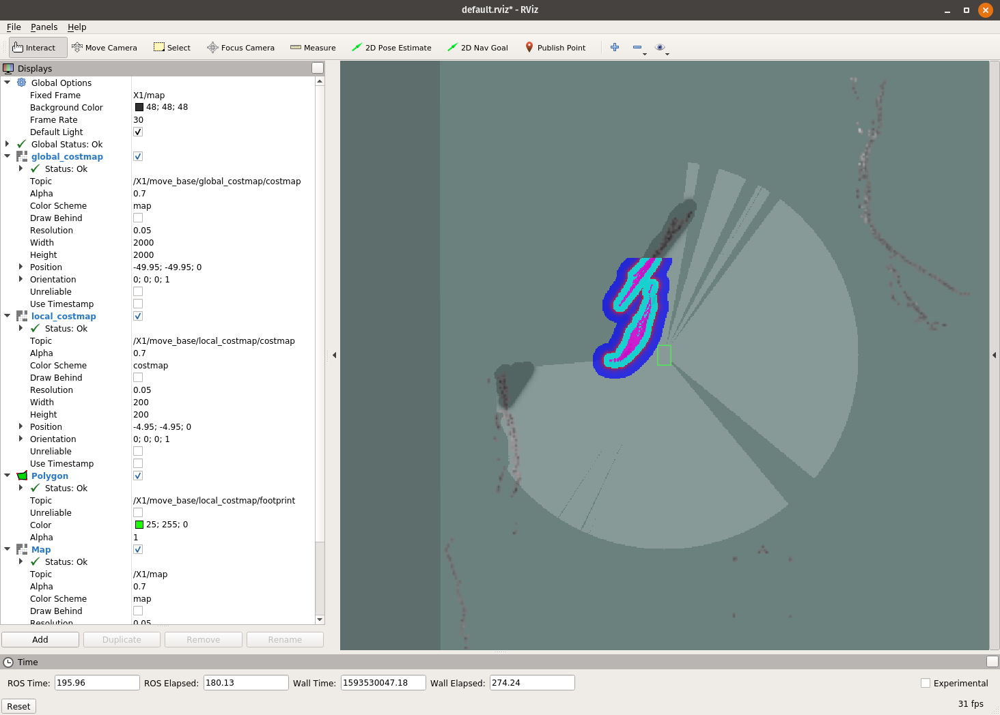
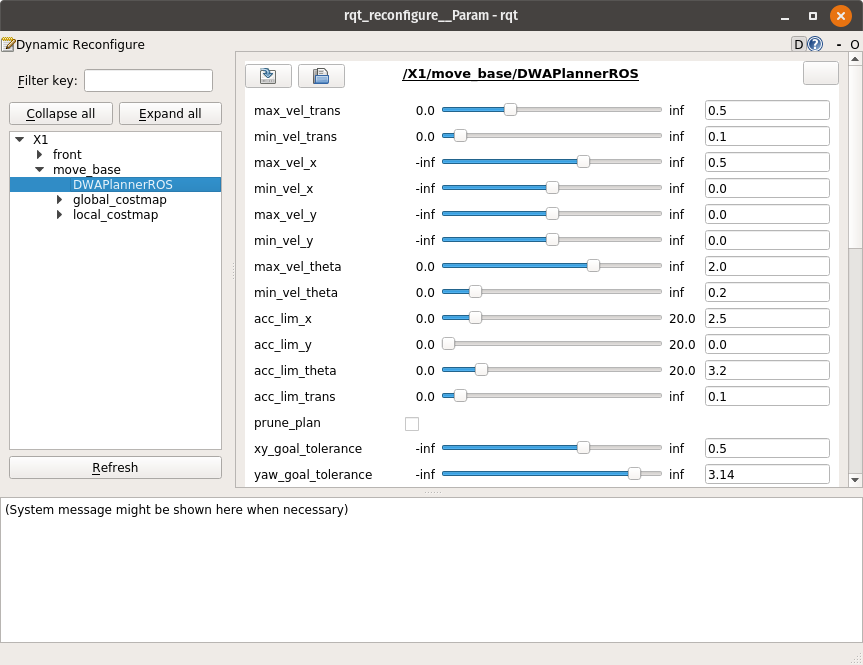
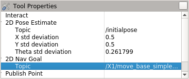
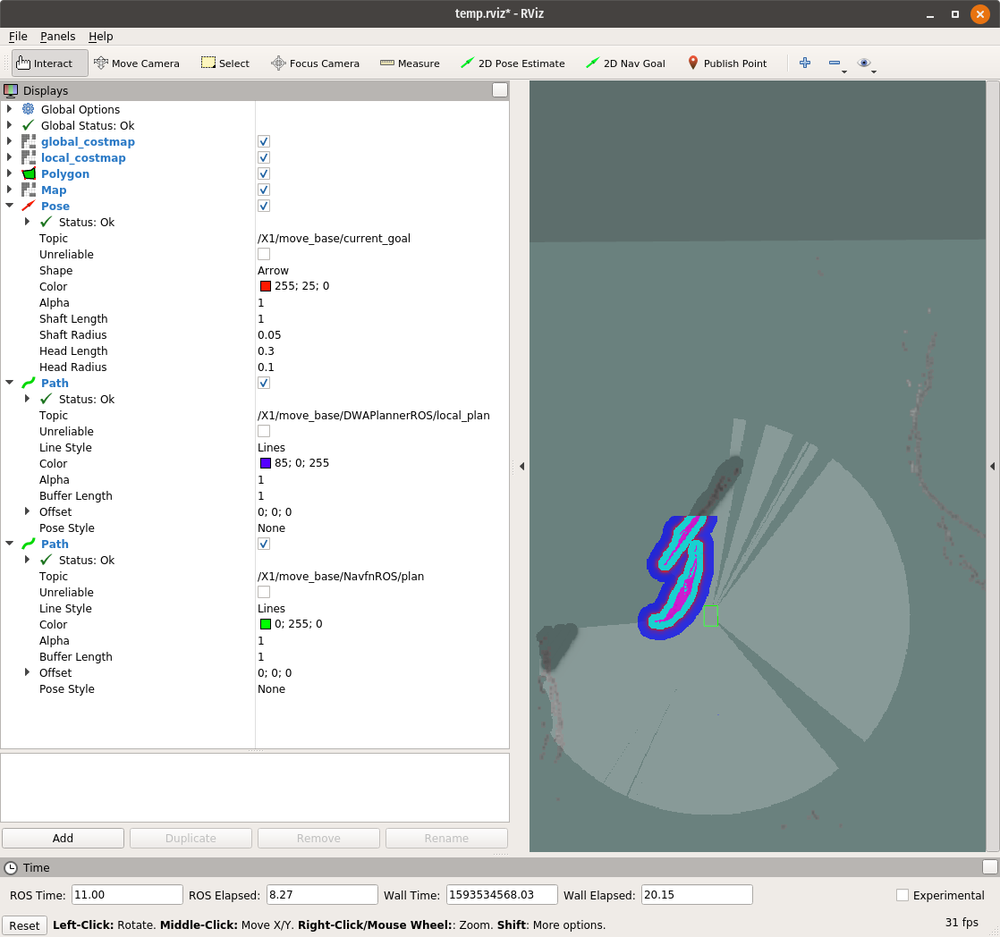
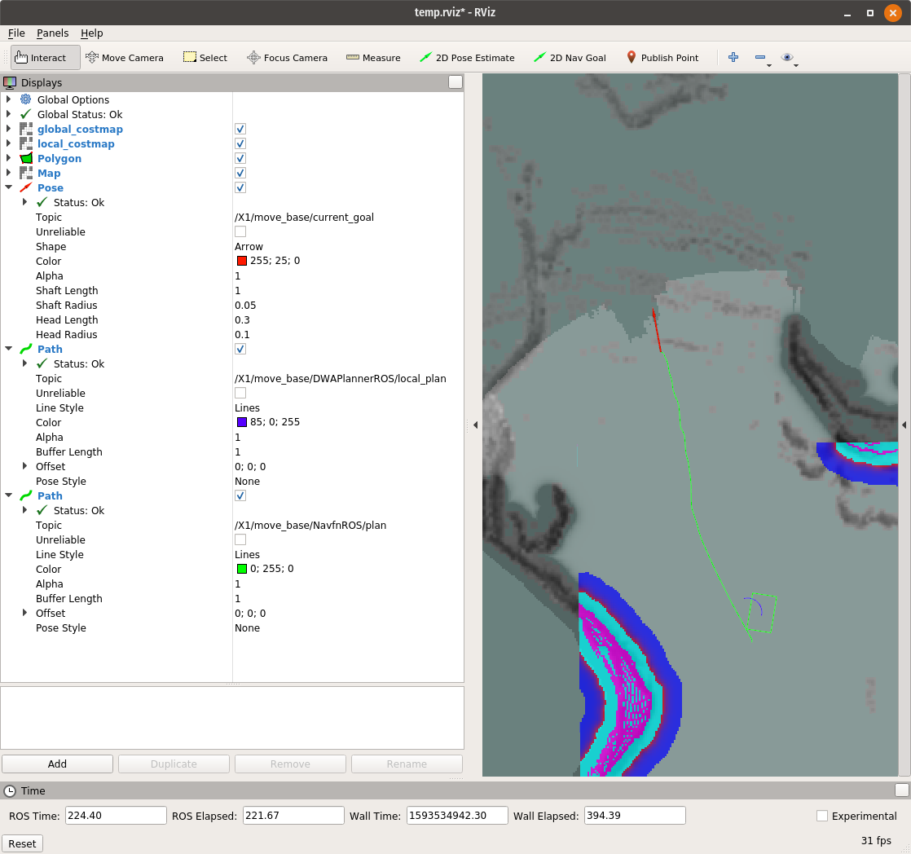

# Navigating Ground Vehicles in the SubT Challenge

## Introduction

In this post, we will add navigation capabilities to our solution.

By the end of this post, our ground vehicle will be capable of navigating to
user-defined waypoint goals in the cave environment. With this waypoint
navigation in place, it should be possible to build higher-level logic that
allows to explore deep into the subterranean environment while coordinating
between multiple robot platforms.

## Overview of Navigation

Several components must be in place to successfully navigate through an unknown environment:

* First we need to create and fill an _occupancy grid_ with our sensor data. You
can think of this occupancy grid as a simplified map that helps us keep track of
explored space, new space, and walls. If you've ever used a minimap in a video
game, it is very similar.
* With our map in hand, we then create a path through the occupancy grid avoiding obstacles.
* From this path, we generate wheel velocity commands to control the robot along the computed path.
* Finally, we create systems to  avoid dynamic obstacles and recover from adverse situations.

Fortunately, the [ROS Navigation Stack](https://wiki.ros.org/navigation)
implements most of this functionality and is fairly easy to incorporate into our ground-based robot platforms. For most of this blog post,
we'll follow the steps outlined in the [navigation robot setup tutorial](http://wiki.ros.org/navigation/Tutorials/RobotSetup).

## Configuration

### Costmaps

The [move_base](http://wiki.ros.org/move_base) package in the navigation stack
uses two levels of planning: _global_ and _local_. Each of these
planners has its own costmap to track the state of the environment around the
robot. The _global_ costmap is typically larger than the _local_ costmap and
tracks space on a longer horizon, while the _local_ costmap is typically
smaller, updates more frequently, and may be higher resolution than the
_global_ costmap.

Since Cartographer (from the [SLAM blog post](https://github.com/osrf/subt_hello_world/blob/master/posts/02_docker_and_slam.md)) set up our
robot's coordinate frames, we can jump straight into configuring the costmap
parameters. To configure the costmaps, we use three configuration files found in `subt_solution_launch/config/move_base/`:
`costmap_common.yaml`, `costmap_local.yaml`, and `costmap_global.yaml`.

A few notes:

* We will use the robot's  LIDAR sensor to populate the data in the costmaps.
* The global costmap's coordinate frame (defined in `costmap_global.yaml`) is `X1/map`, which means that global path planning will occur in the map frame (provided by Cartographer from our previous blog post).
* The local costmap's coordinate frame (defined in `costmap_local.yaml`) is `X1/odom`, which means that local
  path planning will occur in the odometry frame of the robot (this is also
  provided by Cartographer).
* The vehicle footprint in `costmap_common.yaml` needs to match the shape and size of
  the robot platform being used (in this case, we define a rectangular footprint). This footprint is what allows the navigation
  stack to plan collision-free routes.

We can verify that the costmaps are appropriately loaded into the navigation
stack by taking a look at `subt_solution_launch/launch/navigation.launch`.
Inside this launch file you see that the `common` parameters are loaded in two
different namespaces (`local_costmap` and `global_costmap`) because the
parameters in `costmap_common.yaml` are used by both the local and global costmaps.

```
<node pkg="move_base" type="move_base" respawn="false" name="move_base">

    ...

  <rosparam file="$(find subt_solution_launch)/config/move_base/costmap_common.yaml" command="load" ns="global_costmap" />
  <rosparam file="$(find subt_solution_launch)/config/move_base/costmap_common.yaml" command="load" ns="local_costmap" />
  <rosparam file="$(find subt_solution_launch)/config/move_base/costmap_local.yaml" command="load" ns="local_costmap" />
  <rosparam file="$(find subt_solution_launch)/config/move_base/costmap_global.yaml" command="load" ns="global_costmap" />
</node>
```

Another way to verify that the costmaps are appropriately configured is by
running `navigation.launch` and adding the correct displays in RViz. To enable
the costmaps in RViz, simply check the top level box in displays.

```
# Start a simulator
$ cd ~/subt_hello_world/docker/simulation_runner
$ ./run.bash osrf/subt-virtual-testbed:latest cave_circuit.ign circuit:=cave worldName:=cave_qual robotName1:=X1 robotConfig1:=COSTAR_HUSKY_SENSOR_CONFIG_1

# Run the navigation stack in a solution container
$ cd ~/subt_hello_world/docker
$ ./run_dev_container.bash ~/subt_hello_world/subt_solution_launch
$ source ~/setup_solution_ws.bash
$ roslaunch subt_solution_launch navigation.launch name:=X1

# In another docker shell, start RViz
$ cd ~/subt_hello_world/docker
$ ./join.bash
$ rviz
```

You can add the costmap displays to RViz as shown here.



_An example RViz setup with the local and global costmaps from `move_base`.
There's a wall close to the robot, which has been captured in the costmaps._

### Planners

Since we have verified that the costmaps are functional, we can now work on
configuring the local and global planners. For the local planner, it's best to
start with the [`dwa_local_planner`](https://wiki.ros.org/dwa_local_planner)
from the navigation stack.

There are many parameters for the `dwa_local_planner`, but most are exposed as
[`dynamic_reconfigure`](https://wiki.ros.org/dynamic_reconfigure) parameters,
which allows them to be tuned over the course of a run. It is recommended to
set starting parameters, then use `dynamic_reconfigure`
to tune while `move_base` is running. You can run a graphical interface for `dynamic_reconfigure` with the following command:

```
$ rosrun rqt_reconfigure rqt_reconfigure
```

If you still have the launch file running from the costmaps section, you should
be able to see the DWA planner in the reconfigure GUI:



_Some of the dynamically reconfigurable parameters for `DWAPlannerROS`._

The configuration parameters that come with this blog post are a reasonable
starting point, but are not optimal. For more
guidance on parameter tuning, we recommend taking a look at the [ROS Navigation Tuning Guide](http://kaiyuzheng.me/documents/navguide.pdf).
You can come back to this step to tune the parameters after sending a navigation goal (the last step in this post).

## Limitations of `move_base`

One of the big limitations of `move_base` is that it was primarily developed for
structured 2D environments such as office buildings or warehouses. The `move_base` package typically assumes that a robot is on a plane and will only move in
the X and Y directions and rotate about the Z axis (yaw). It also
assumes obstacles are within a certain height of the robot's XY navigation
plane. These assumptions can cause issues when navigating through a 3D
environment with uneven terrain and slopes (like a cave). Underground environments also have unique shapes, verticality, and can span multiple stories.

If you attempt to use `move_base` in the cave worlds without adjustments, the robot will get stuck quickly and be unable
to navigate because `move_base` perceives slopes as
obstacles.

### Addressing the 2D Assumption

In order to use `move_base` in a complex environment, we wrote two new nodes to:

* "Flatten" the `base_link` frame into a `fake` frame.
This is accomplished by removing the roll, pitch, and z channels from the
original `base_link` coordinate frame. The `move_base` package can use the new `fake` frame to determine the location of the robot with only the 2D components.
The 2D frame is necessary because `move_base` only considers obstacles within 2m height from the origin of its 2D costmap.
Now, if the robot goes up or down a hill, the obstacles seen by the robot will be interpreted as within the 2m height range in the costmap.
* Filter the point cloud to differentiate between sloped terrain and obstacles in a 3D environment.

The first node is straightforward, as it simply takes in a pose and
strips off the rotation information. An example implementation
can be found in:
`subt_solution_launch/src/base_link_costmap_projector.cpp`.

The second node (`subt_solution_launch/src/pc_filter.cpp`) has some more
involved filtering of the point cloud. The goal of this node is to discern
between traversable areas and obstacles or areas too steep for the robot to traverse. In this
`filter_pc` method, the following happens:

1. The point cloud is transformed from the original sensor frame to the `fake`
   flattened sensor frame.
2. For each point in the point cloud, an approximation of slope is computed by
   looking at neighboring points.
3. Points that have a slope above the threshold are incorporated into a new
   point cloud that denotes obstacles.
4. The filtered point cloud is sent to `move_base`.

This filter handles some types of terrain present
in the cave environments. You can replace this with more advanced filtering and traversability analysis
techniques. The [PointCloud Library](https://pointclouds.org/) and
[grid_map](http://wiki.ros.org/grid_map) are helpful resources.

## Putting it all together

`subt_solution_launch/launch/navigation.launch` represents all of the
functionality described in this blog post combined as a launch file.

With this, we can now send the robot simple navigation commands either via the
command line, another node, or most easily with RViz.

You should already have the simulator, launch file, and rviz running from the
costmap section of this tutorial (if not, please take a second to restart these
components). The `publish_pose` tool in RViz allows for navigation goals to be
set and sent to `move_base`. Before we use this tool, we need to make sure that
the _2D Nav Goal_ topic in RViz is correct. Go to `panels`->`tool properties`,
and set the _2D Nav Goal_ topic to `/X1/move_base_simple/goal` as shown here:



We can also add a few displays to visualize the paths generated by
the local and global planners, along with the current navigation goal:



Now that we have everything configured, let's send a navigation goal to the
robot! Select _2D Nav Goal_ from the top bar menu, and place a goal in an
obstacle-free location close by. You should see the robot start to move along
the generated path, with the costmaps updating real-time:



_A robot moving towards a navigation goal in RViz. The black curve represents
the local plan, while the green curve represents the global plan._

## Conclusion and Next Steps

You now have a robot that can perform local navigation through a 3D
environment. While this technique allows the robot to plan paths, it certainly has
limitations, and a good next step is to search for alternatives or continue refine the parameters and
filtering strategies to improve the robot's capabilities.
You can also check out [this tutorial](http://wiki.ros.org/navigation/Tutorials/SendingSimpleGoals) to learn how to send waypoints programmatically instead of manually through RViz.
This can be used to expand the robot's navigation into a fully autonomous solution.

Our next post will
show you how to communicate between two different robots in the same environment, so you can move towards multi-robot coordination.
