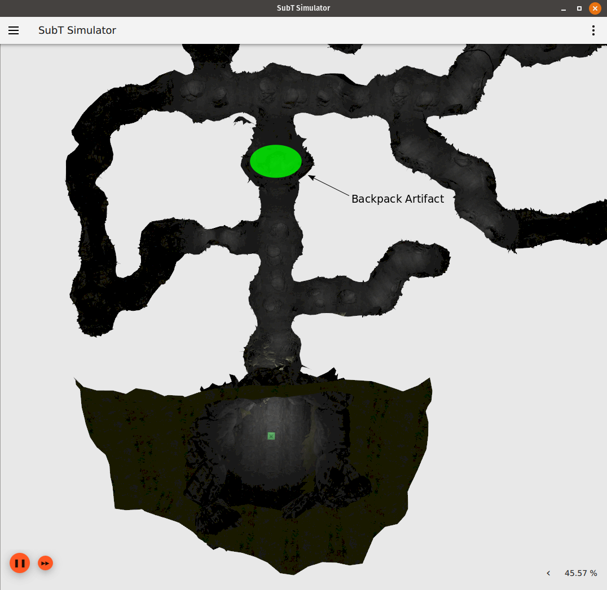
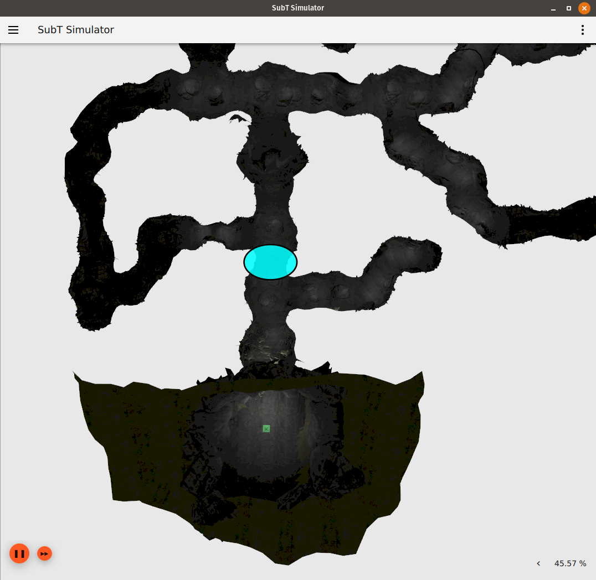
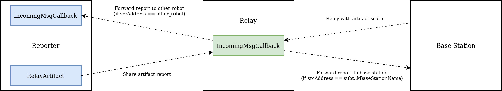
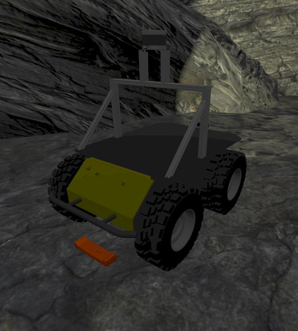
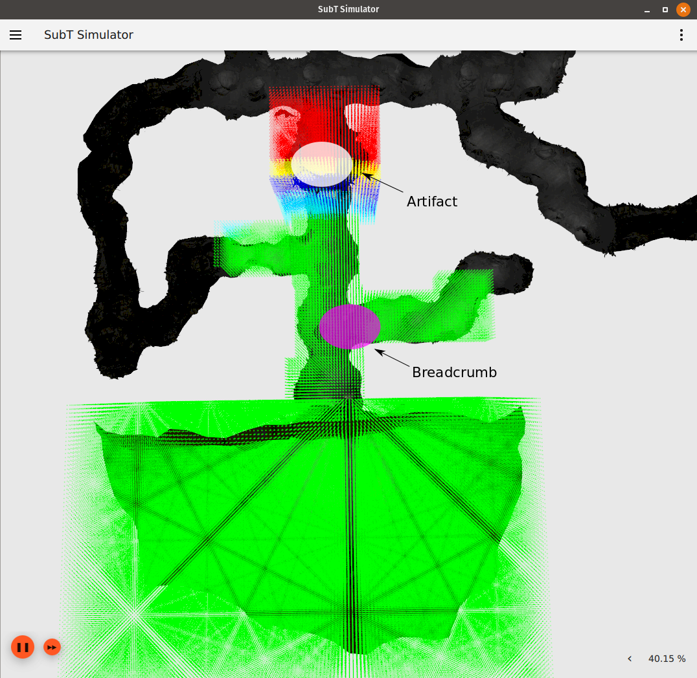
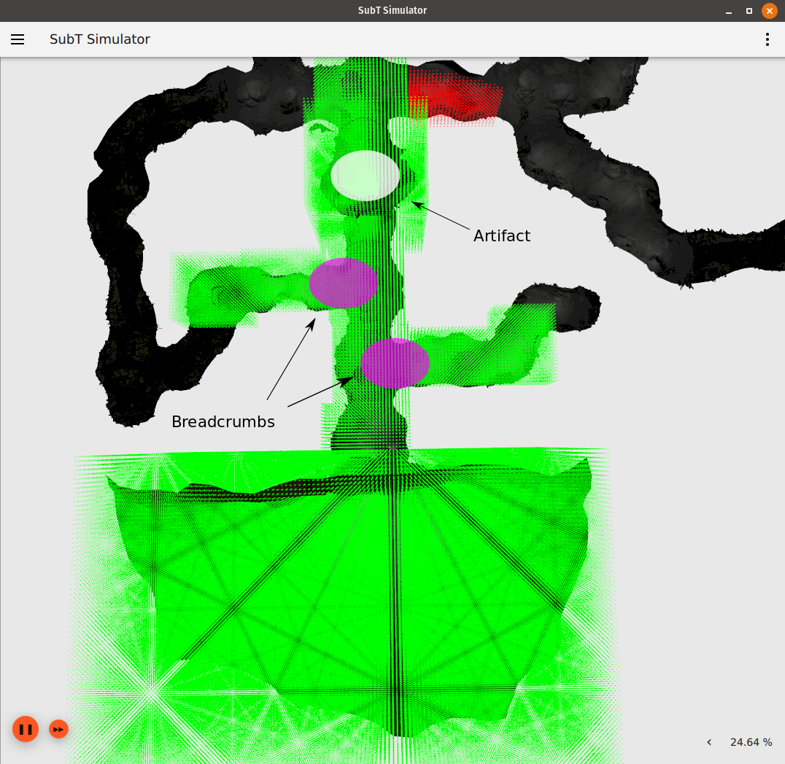
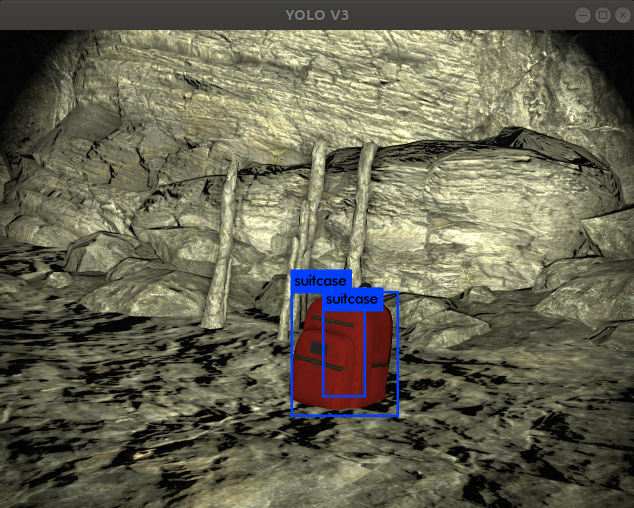

# Enhancing Robot Communication Capabilities in the SubT Challenge

## Introduction

One of the biggest hurdles in a subterranean environment is degraded communications.
Robots often rely on existing communication infrastructure like 3G/4G/5G wireless carriers, satellite communications, and other forms of radio technology that were designed for terrestrial communications, and often require line of sight.
Similarly, for navigation, terrestrial robots rely on GPS technology to determine a global position fix.
In a subterranean environment, these technologies are not available or perform differently than they would above ground.
For these reasons, the SubT Challenge requires a great deal of innovation on the part of robot developers.

In this post, we will discuss how to set up communications between two different robot platforms and show how communication ranges can be increased using breadcrumbs.
If you are unfamiliar with communication "breadcrumbs", they are small battery powered communication devices that can be deployed by a robot.
We will be using the [communications](https://github.com/osrf/subt/wiki/api#communications) and [breadcrumbs](https://github.com/osrf/subt/wiki/api#breadcrumbs) sections of the SubT Virtual Testbed API, so please take a moment to familiarize yourself with the content in these sections before continuing this post.

## Motivation

Before we go over communications in greater depth, let's discuss why communications are an important part of the SubT Challenge.

### If robots can interact with the base station directly, why should multiple robots communicate with each other?

If multiple robots can communicate with each other, they can share valuable information with one another (maps of areas they have explored, locations of detected artifacts, etc.).

Sharing information between robots allows a team of robots to "divide and conquer" the SubT Challenge task.
By sharing information, a team of robots can coordinate their search of the environment to minimize duplicated effort and quickly search more of the underground world.

Another useful case for communication between robots is when a ground vehicle finds a region can only be explored by an aerial vehicle or vice versa.

### Why do we need breadcrumbs?

For our purposes, a breadcrumb can be thought of as a communication device that increases the communication range.
The [API](https://github.com/osrf/subt/wiki/api) states that a breadcrumb "operates as a static network relay".

Let's work through an example to help understand why breadcrumbs are useful.

First, start a simulation environment in the `cave_qual` world, using  a robot with an RGBD camera (such as the `COSTAR_HUSKY_SENSOR_CONFIG_1`):

```
$ cd ~/subt_hello_world/docker/simulation_runner
$ ./run.bash osrf/subt-virtual-testbed:latest cave_circuit.ign worldName:=cave_qual robotName1:=X1 robotConfig1:=COSTAR_HUSKY_SENSOR_CONFIG_1
```

Now, let's run the `detect_and_report_artifacts.launch` file that was introduced in the [perception post](./03_perception.md).
This will start a neural network that can detect backpack artifacts and also set up communications between the robot and base station:

```
$ cd ~/subt_hello_world/docker/
$ ./run_dev_container.bash ~/subt_hello_world/subt_solution_launch

# run the following commands in the docker container
$ source ~/setup_solution_ws.bash
$ roslaunch subt_solution_launch detect_and_report_artifacts.launch name:=X1
```

Let's also keep an eye on the `/subt/score` topic so we can see if artifacts we detect scored a point or not:

```
# open a new terminal and connect to the development docker container
$ cd ~/subt_hello_world/docker/
$ ./join.bash

# run the following command in the docker container
$ rostopic echo /subt/score
```

Last but not least, set up keyboard teleop so that we can drive the robot around the `cave_qual` environment. _Note: you could also choose to run `navigation.launch` from the [navigation post](./04_navigation.md) to send waypoints to the robot._

```
# open a new terminal and connect to the development docker container
$ cd ~/subt_hello_world/docker/
$ ./join.bash

# run the following command in the docker container to run teleop control via keyboard
$ rosrun teleop_twist_keyboard teleop_twist_keyboard.py cmd_vel:=/X1/cmd_vel
```

Let's drive the robot to the nearest backpack artifact in the `cave_qual` world.
The location of this backpack is highlighted in the image below.



_The location of the backpack artifact that is closest to the base station in `cave_qual`, highlighted in green._

Once the robot has detected the backpack, you'll notice that the output of the `/subt/score` topic is still 0.
This is because the robot is outside of communication range with the base station.
In order the base station to receive our artifact report, we need to drive back towards the base station until we are close enough to be in communication range.

Go ahead and drive back towards the base station, and don't stop until the base station has received the robot's artifact report.
You can verify that the base station has received the robot's artifact report if you see output similar to the following in the terminal that is running the simulator:

```
[Msg] SimTime[111 556000000] OnNewArtifact Msg=pose {
  position {
    x: 93.57480970329064
    y: -0.4195383363778829
    z: 1.5163309080640626
  }
}

[Msg]   [Total]: 1
[Msg] Total score: 1
```

Take a moment to look at how far back you had to go in order to report the artifact. You should be somewhere near the following area:



_The approximate edge of the communication range for the base station in the first main hallway of `cave_qual`, highlighted in blue._

Returning to this point to regain communication can take a significant amount of time, and requires the robot to backtrack through space that it has already navigated through.
If we use breadcrumbs, the robot may be able to report the backpack artifact from where the artifact was detected, eliminating the need to backtrack.

## Configuration

Now that we have discussed why robot to robot communication and breadcrumbs are important, let's go over how we will use each of these concepts to enhance our solution.

We will spawn 2 robots: _reporter_ and _relay_.

* _reporter_ will navigate through the environment, looking for artifacts.
* _relay_ will stay put in the robot's starting area.
* once _reporter_ detects an artifact, it will send an artifact report to _relay_.
* _relay_ will then pass this message along to the base station for scoring.
Once the base station has received this artifact report, it will let _relay_ know whether this report scored a point or not.
* _relay_ will then pass the base station's message along to _reporter_, letting _reporter_ know that the artifact report was received by the base station.

The diagram below reflects the configuration that was just outlined.
The next two sections will go into the methods for _reporter_ and _relay_ in greater depth.



_A diagram depicting how the **reporter**, **relay**, and **base station** communicate with one another.
The colored boxes represent a method that handles communications (blue for **reporter** and green for **relay**).
Dotted lines reflect the fact that every time a message is sent between two different components, it may be lost/dropped with some probability._

### Reporter Robot

Let's take a look at `~/subt_hello_world/subt_solution_launch/artifact_reporter_comms.cpp`, which is the source code for the _reporter_ robot.
A lot of this code is similar to `~/subt_hello_world/subt_solution_launch/artifact_reporter.cpp`, which was introduced in the [perception post](./03_perception.md).
Since the perception post explains a lot of the code for detecting an artifact, we'll focus on the code that reports an artifact to the _relay_ robot.
First, let's discuss the `main`:

```c++
int main(int argc, char *argv[])
{
  ros::init(argc, argv, "artifact_reporter");
  ros::NodeHandle nh;

  ros::NodeHandle private_nh("~");
  private_nh.param("robot_name", robot_name, std::string("X1"));
  private_nh.param("camera_frame", camera_frame, robot_name + "/base_link/camera_front");
  private_nh.param("artifact_origin_frame", artifact_origin_frame, std::string("artifact_origin"));
  private_nh.param("rgbd_pc_topic", rgbd_pc_topic, "/" + robot_name + "/rgbd_camera/depth/points");
  private_nh.param("darknet_bb_topic", darknet_bb_topic, std::string("/darknet_ros/bounding_boxes"));
  private_nh.param("destination_address", dst_address, std::string(subt::kBaseStationName));

  tf2_ros::Buffer tf_buffer;
  tf2_ros::TransformListener tf_listener(tf_buffer);

  // set up communications for artifact reporting
  subt::CommsClient commsClient(robot_name);
  commsClient.Bind(&IncomingMsgCallback, robot_name);

  // found artifacts will be attempted to be sent periodically through a timer
  ros::Timer timer = nh.createTimer(ros::Duration(1.0), boost::bind(&RelayArtifact, _1, boost::ref(commsClient)));

  // when darknet detects an object, we need the corresponding point cloud data from the RGBD camera
  // so that we can determine the location of this object
  message_filters::Subscriber<sensor_msgs::PointCloud2> pc_sub(nh, rgbd_pc_topic, 1);
  message_filters::Subscriber<darknet_ros_msgs::BoundingBoxes> bb_sub(nh, darknet_bb_topic, 1);
  message_filters::TimeSynchronizer<sensor_msgs::PointCloud2, darknet_ros_msgs::BoundingBoxes> sync(pc_sub, bb_sub, 10);
  sync.registerCallback(boost::bind(&ProcessDetection, _1, _2, boost::ref(tf_buffer)));

  ros::spin();
}
```

A lot of this code should be familiar from the [perception post](./03_perception.md): initialize the node, read in any parameters, and set up communications and perception.
There's one key difference in `main` that allows this robot to communicate with another robot:

```c++
private_nh.param("destination_address", dst_address, std::string(subt::kBaseStationName));
```

We are now allowing the destination address to be configured as a parameter.
This address will default to the base station if no parameter is given, but we can also set this parameter to the name of the _relay_ robot if we wish.

```c++
// set up communications for artifact reporting
subt::CommsClient commsClient(robot_name);
commsClient.Bind(&IncomingMsgCallback, robot_name);

// found artifacts will be attempted to be sent periodically through a timer
ros::Timer timer = nh.createTimer(ros::Duration(1.0), boost::bind(&RelayArtifact, _1, boost::ref(commsClient)));
```

A lot of this code is based on the communications section of the [SubT Virtual Testbed API](https://github.com/osrf/subt/wiki/api#communications).
First, we initialize a `commsClient` object with the address being the name of the _reporter_ robot.
Then, we use `subt::CommsClient::Bind` to set the _reporter_'s communications callback function to `IncomingMsgCallback`.
This means that whenever the _reporter_ robot receives a message, `IncomingMsgCallback` will be called.
Lastly, we use a [ros::Timer](https://wiki.ros.org/roscpp/Overview/Timers) to call the `RelayArtifact` method every second.

Let's go over the `IncomingMsgCallback` and `RelayArtifact` methods in greater detail.

```c++
void IncomingMsgCallback(
  const std::string & srcAddress,
  const std::string & dstAddress,
  const uint32_t dstPort,
  const std::string & data)
{
  // since the artifact we saved has been reported, we no longer have an artifact to report
  // until we detect another one
  have_an_artifact_to_report = false;
}
```

As we previously mentioned, `IncomingMsgCallback` is called whenever the _reporter_ robot receives a message.
Since we are only passing around messages that pertain to detected artifact reports, we know that if this method is called, it means that the _reporter_'s latest artifact report was received by the base station.
So, if this method is ever called, all we need to do is make a note that we don't have an artifact to report, since our last reported artifact was received successfully.

```c++
void RelayArtifact(const ros::TimerEvent &, subt::CommsClient & commsClient)
{
  if (!have_an_artifact_to_report)
  {
    return;
  }

  auto location = artifact_to_report.location;
  ignition::msgs::Pose pose;
  pose.mutable_position()->set_x(location.x);
  pose.mutable_position()->set_y(location.y);
  pose.mutable_position()->set_z(location.z);

  // fill the type and pose
  subt::msgs::Artifact artifact;
  artifact.set_type(static_cast<uint32_t>(artifact_to_report.type));
  artifact.mutable_pose()->CopyFrom(pose);

  // serialize the artifact
  std::string serializedData;
  if (!artifact.SerializeToString(&serializedData))
  {
    ROS_ERROR_STREAM("ArtifactReporter::ReportArtifact(): Error serializing message\n" << artifact.DebugString());
  }

  // share the artifact
  commsClient.SendTo(serializedData, dst_address);
}
```

In `RelayArtifact`, we only send an artifact report if we have a detection to share.
In order to share a detection, we need to extract the artifact's type and location.
Let's take a closer look at the last line:

```c++
commsClient.SendTo(serializedData, dst_address);
```

We send the artifact report (serialized as a string) to `dst_address`, which was defined earlier as a parameter.
This means that the robot can either send this information to another robot or the base station.
For the purposes of this tutorial, we will show what happens when `dst_address` is the address of another robot (_relay_).

It's important to note that calling `SendTo` doesn't guarantee that the message sent by the _reporter_ was received by _relay_.
The only way for the _reporter_ to know if a sent message was received is by getting a response through `IncomingMsgCallback`.
The method presented here functions similarly to [UDP](https://en.wikipedia.org/wiki/User_Datagram_Protocol).
This means that messages sent by the _reporter_ and acknowledgements/responses meant for the _reporter_ may be lost in transit.
Messages can always be re-sent if a connection is temporarily lost.

### Relay Robot

Now that we have discussed how communications work for the _reporter_ robot, let's take a look at how the _relay_ robot works.
Open up `~/subt_hello_world/subt_solution_launch/report_relay.cpp`.
Let's start off by taking a look at `main`:

```c++
int main(int argc, char *argv[])
{
  ros::init(argc, argv, "artifact_report_relay");
  ros::NodeHandle nh;

  ros::NodeHandle private_nh("~");
  private_nh.param("robot_name", robot_name, std::string("X1"));
  private_nh.param("other_robot", other_robot, std::string("X2"));

  // set up communications for artifact reporting
  commsClient = new subt::CommsClient(robot_name);
  commsClient->Bind(&IncomingMsgCallback, robot_name);

  ros::spin();
}
```

A lot of the communications setup for the _relay_ robot is similar to the _reporter_ robot - this time, however, `robot_name` is the name of the _relay_ robot.
The _relay_ robot also has a callback that is triggered whenever this robot receives a message (`IncomingMsgCallback`).
Let's take a look at how the _relay_ robot handles new messages:

```c++
void IncomingMsgCallback(
  const std::string & srcAddress,
  const std::string & dstAddress,
  const uint32_t dstPort,
  const std::string & data)
{
  if (srcAddress == other_robot)
  {
    // we received an artifact from the other robot,
    // so we need to send this artifact message to the base station
    commsClient->SendTo(data, subt::kBaseStationName);
  }
  else if (srcAddress == subt::kBaseStationName);
  {
    // the base station has received the artifact we relayed from the other robot,
    // so we need to let the other robot know that the relay succeeded
    commsClient->SendTo(data, other_robot);
  }
}
```

As we can see in the code above, the method first checks who sent the message.
If the _reporter_ (`other_robot`) was the sender of the message, then the _relay_ robot forwards this message to the base station.
If the base station (`subt::kBaseStationName`) was the sender of the message, then the _relay_ robot forwards this message to let the _reporter_ knows its original message was received by the base station.

### Using the Reporter and Relay in a Launch File

Now that we understand how the _reporter_ and _relay_ robots work, we need a way to run the two robots together.
We can do this through a launch file.
Take a look at `~/subt_hello_world/subt_solution_launch/launch/communications.launch`:

```xml
<?xml version="1.0" encoding="utf-8"?>

<launch>
  <arg name="reporter_name"/>
  <arg name="relay_name"/>

  <group ns="$(arg reporter_name)">
    <!-- Cartographer setup -->
    <include file="$(find subt_solution_launch)/launch/cartographer.launch">
      <arg name="name" value="$(arg reporter_name)"/>
      <arg name="mode" value="3d"/>
      <arg name="type" value="x1"/>
    </include>

    <node pkg="subt_solution_launch" type="artifact_origin_finder" name="artifact_origin_finder">
      <param name="robot_name" value="$(arg reporter_name)" />
    </node>

    <node pkg="subt_solution_launch" type="artifact_reporter_comms" name="artifact_reporter_comms" output="screen">
      <param name="robot_name" value="$(arg reporter_name)" />
      <param name="destination_address" value="$(arg relay_name)" />
    </node>
  </group>

  <include file="$(find subt_solution_launch)/launch/yolo_v3-tiny.launch" />

  <node pkg="subt_solution_launch" type="report_relay" name="report_relay" output="screen">
    <param name="robot_name" value="$(arg relay_name)"/>
    <param name="other_robot" value="$(arg reporter_name)" />
  </node>
</launch>
```

This launch file takes two arguments:

1. The name of the _reporter_ robot (`reporter_name`)
2. The name of the _relay_ robot (`relay_name`).

This launch file will run several nodes:

1. `cartographer` (SLAM).
This is needed in order to dertermine artifact locations in a "global frame".
For more information about Cartographer and SLAM, take a look at the [docker and slam](./02_docker_and_slam.md) post.
2. `artifact_origin_finder`.
This node finds the artifact origin, which serves as the "global frame" mentioned above.
For more information about the artifact origin frame, take a look at the [perception post](./03_perception.md) and/or the [API](https://github.com/osrf/subt/wiki/api).
3. `artifact_reporter_comms` (the _reporter_ robot).
For more information about how this executable was generated, take a look at `~/subt_hello_world/subt_solution_launch/CMakeLists.txt`.
4. `darknet_ros` (image detection).
For more information about `darknet_ros`, take a look at the [perception post](./03_perception.md).
5. `report_relay` (the _relay_ robot).
For more information about how this executable was generated, take a look at `~/subt_hello_world/subt_solution_launch/CMakeLists.txt`.

Before we run this launch file, we'll try dropping a breadcrumb so our robots can relay messages from even deeper in the environment.

### How to Drop a Breadcrumb

We've gone over how to relay information through robots.
Let's also take a moment to go through how to drop a breadcrumb.

Start a simulator that spawns a robot with breadcrumb capabilities (you can see which robots have breadcrumbs by taking a look at the [robots](https://github.com/osrf/subt/wiki/Robots) page of the SubT Virtual Testbed wiki).
In this example, we're using `COSTAR_HUSKY_SENSOR_CONFIG_2`:

```
$ cd ~/subt_hello_world/docker/simulation_runner
$ ./run.bash osrf/subt-virtual-testbed:latest cave_circuit.ign worldName:=cave_qual robotName1:=X1 robotConfig1:=COSTAR_HUSKY_SENSOR_CONFIG_2
```

In order to drop a breadcrumb, we need to publish a message the the `/ROBOT_NAME/breadcrumb/deploy` topic.
Since the name of the robot in the simulator is `X1`, we'll need to publish a message to the `/X1/breadcrumb/deploy` topic.
Open another terminal that connects to the simulation container and run the following command to drop a breadcrumb (we use `--once` so that the publish call returns once the breadcrumb has been dropped):

```
# you can open another terminal that gives you a shell in the simulation container using this command
$ docker exec -it `docker ps --filter ancestor=osrf/subt-virtual-testbed --format {{.ID}}` /bin/bash

# now, run the following command in the connected terminal instance to drop a breadcrumb
$ rostopic pub /X1/breadcrumb/deploy std_msgs/Empty "{}" --once
```

In the simulator, you should now see a breadcrumb behind the robot:



_A breadcrumb dropped by a robot._

## Running the Reporter and Relay Robots With Breadcrumbs

Now, let's test our robot relay and breadcrumbs together to see if we can achieve long-range communication.
We'll need to start a simulator with **two** robots this time:

```
$ cd ~/subt_hello_world/docker/simulation_runner
$ ./run.bash osrf/subt-virtual-testbed:latest cave_circuit.ign worldName:=cave_qual robotName1:=X1 robotConfig1:=COSTAR_HUSKY_SENSOR_CONFIG_2 robotName2:=X2 robotConfig2:=X2_SENSOR_CONFIG_1
```

Once everything loads, you should see two robots in the starting area.

In this example, `robotConfig1` is the _reporter_, and `robotConfig2` is the _relay_.
We chose `robotConfig1` to be `COSTAR_HUSKY_SENSOR_CONFIG_2` because this robot has an RGBD camera (for perception) and breadcrumbs.
Since `robotConfig2` is the _relay_ robot, you can set this robot to any configuration you'd like (it doesn't need a camera for perception or breadcrumb capabilities for this example).
We chose `X2_SENSOR_CONFIG_1` to be `robotConfig2` since it has a low cost.
For more information about the different robot configurations that are available, take a look at the [robots](https://github.com/osrf/subt/wiki/Robots) page of the wiki.

After starting a simulator, run `communications.launch` in our development Docker container:

```
$ cd ~/subt_hello_world/docker/
$ ./run_dev_container.bash ~/subt_hello_world/subt_solution_launch

# run the following commands in the docker container
$ source ~/setup_solution_ws.bash
$ roslaunch subt_solution_launch communications.launch reporter_name:=X1 relay_name:=X2
```

Notice that `reporter_name` matches `robotName1` (from the simulator command), and `relay_name` matches `robotName2`.

We also need to start teleop control so that we can drive the _reporter_ through the cave, looking for artifacts.
Connect to the docker container in another terminal to accomplish this:

```
# start another shell session in the docker container
$ cd ~/subt_hello_world/docker/
$ ./join.bash

# run the following in the docker container
$ rosrun teleop_twist_keyboard teleop_twist_keyboard.py cmd_vel:=/X1/cmd_vel
```

Let's also echo the `/subt/score` topic:

```
$ rostopic echo /subt/score
```

This will give us a way to tell when a detection from the _reporter_ robot has been received by the base station.
Once the base station receives the _reporter_'s backpack artifact report, we should see the output of `/subt/score` change from `0` to `1` (indicating that our report was not only received, but that our report was also correct).

We now have all of the necessary programs running in order to test our communication framework.
Before we discuss how to use breadcrumbs as we drive the _reporter_ robot around the cave, let's discuss how you can visualize the communication range between multiple robots.

### Visualizing Communication Range

There's a [tutorial](https://github.com/osrf/subt/wiki/Breadcrumbs-and-communication-visualization-tutorial) on the SubT Virtual Testbed Wiki that goes through how to visualize the communication range between two robots.
In order to follow this tutorial, you need to install `ignition-citadel` (whereas `ignition-blueprint` is the backbone of the SubT Virtual Testbed for Cave Circuit).
Since it takes a bit of work to get this tutorial working, we've gathered some example visualizations for you later in this tutorial.

If you're interested in testing out communications visualization yourself, you'll need to use the files provided in `~/subt_hello_world/docker/subt_catkin_install`.
This directory contains a Docker setup that allows you to follow the [Catkin Installation](https://github.com/osrf/subt/wiki/Catkin%20System%20Setup) instructions, which is needed in order to swap out `ignition-blueprint` with `ignition-citadel`.

### Using Breadcrumbs

At this point, you should have started a simulator that spawned two robots in the `cave_qual` world.
We will now re-visit the backpack in `cave_qual` from earlier in this post, dropping breadcrumbs along the way.
Dropping breadcrumbs will extend the communication range between the _reporter_ and _relay_ robots so that we don't need to drive the _reporter_ back towards the base station once the backpack has been detected.


_Breadcrumbs will be dropped by the **reporter** robot in order to increase the communication range between the two robots._

Before we start driving the _reporter_ robot towards the backpack, let's take a look at the initial communication range for the _relay_ robot.


_The communication range for the **relay** robot if no breadcrumbs are used._

As we can see in the diagram, the backpack location is outside of the default communication range.
Let's drive the _reporter_ robot to the first 3-way intersection (the one that branches to the right) and drop a breadcrumb there.
Once you're at the intersection, run the following command in another shell to drop a breadcrumb:

```
$ rostopic pub /X1/breadcrumb/deploy std_msgs/Empty "{}" --once
```

Now, if you take a look at the _reporter_ robot in the simulator, you should see a breadcrumb that has been dropped just behind it.
Now that we've dropped a breadcrumb, let's take a look at the communications range for the _relay_ robot again:



_The communication range for the **relay** robot, using 1 breadcrumb which is highlighted in purple._

Our communication range has increased, but the artifact still seems to be just out of range.
If we drive to the next 3-way intersection (with a branch to the left) and drop a breadcrumb there, then we should be good to go!

Take a moment to drive to the next intersection, and drop another breadcrumb there (run the same command that was used to drop a breadcrumb at the other intersection).
The communication range would now look something like this:



_The communication range for the **relay** robot, using 2 breadcrumbs, highlighted in purple._

Great! The artifact should now be within communication range of the _relay_ robot.
All that's left is driving the _reporter_ to the backpack artifact.
Once the _reporter_ detects this artifact, the _reporter_ will attempt to send this artifact report to the _relay_ periodically until the _reporter_ is notified that this detection has been received.

Now that we have a way to know if the _reporter_'s artifact report has been received or not, drive the _reporter_ to the backpack artifact.
You'll know that the robot has detected the backpack when you see blue boxes around the backpack in the Yolo V3 GUI, labelled "suitcase" (if you're wondering why the boxes are labeled "suitcase" instead of "backpack", you can read the section called _So Why Are We Using Pre-Trained Neural Networks?_ in the [perception post](./03_perception.md)).



_An example output from `darknet_ros`, indicating that a backpack has been detected._

Once you've detected the backpack, there's a chance that the `/subt/score` topic is still outputting `0`, since communications are probabilistic.
If that's the case, try dropping another breadcrumb near the backpack, and then move the _reporter_ robot to the top of the hill by the backpack artifact.
You should see the output of `/subt/score` change to 1.

## Conclusion

Now that you have finished going through this post, you should have all of the necessary resources to incorporate robot to robot communication in your solution! 
As a follow-on, you can try sharing other types of data (for example, robot maps or goal locations) between robots to allow cooperative exploration.

In the next blog post, we'll learn more about multi-robot coordination.
